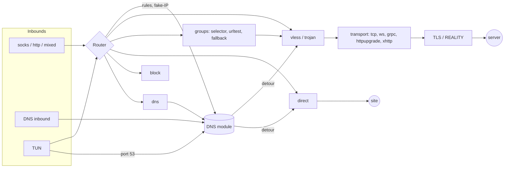

[Русский](ARCHITECTURE.md) | [English](ARCHITECTURE.en.md)

# How the core works

A technical description for anyone who will read, change or embed the core:
what it consists of, what happens to a connection from the inbound to the
server, where each decision is made and why. How to use the client is in
the [README](../README.en.md); the stage-by-stage decision history is in
[PLAN.md](../PLAN.md) (in Russian).

Contents:

1. [What this is and which rules it follows](#1-what-this-is-and-which-rules-it-follows)
2. [Repository map](#2-repository-map)
3. [Overall picture](#3-overall-picture)
4. [Lifecycle: start, run, reload, stop](#4-lifecycle-start-run-reload-stop)
5. [Configuration](#5-configuration)
6. [Path of a TCP connection through SOCKS5/HTTP](#6-path-of-a-tcp-connection-through-socks5http)
7. [UDP](#7-udp)
8. [TUN](#8-tun)
9. [Routing](#9-routing)
10. [Outbounds](#10-outbounds)
11. [Server groups and subscriptions](#11-server-groups-and-subscriptions)
12. [DNS](#12-dns)
13. [Transports](#13-transports)
14. [Protocols: VLESS, Vision, XUDP, Mux.Cool, Trojan](#14-protocols-vless-vision-xudp-muxcool-trojan)
15. [REALITY and TLS fingerprints](#15-reality-and-tls-fingerprints)
16. [API, connection tracking and events](#16-api-connection-tracking-and-events)
17. [Security](#17-security)
18. [Performance and memory](#18-performance-and-memory)
19. [Errors and logging](#19-errors-and-logging)
20. [Platforms](#20-platforms)
21. [Tests and verification](#21-tests-and-verification)
22. [How to extend](#22-how-to-extend)
23. [Limits and timeouts](#23-limits-and-timeouts)

---

## 1. What this is and which rules it follows

A VPN client core in Rust. It accepts traffic from programs (SOCKS5, HTTP
proxy, DNS server, TUN), decides by rules where to send it, and sends it:
to a VLESS or Trojan server (with REALITY/TLS, over tcp, ws, grpc,
httpupgrade, xhttp), directly, or nowhere. The GUI client is a separate
project; the core is the `reality-core` library plus the `reality-client`
program on top of it.

Rules that run through the whole code base:

- **Compatibility is checked against real Xray-core.** Protocols,
  transports and fingerprints are ports of Xray's logic, with links to its
  sources in the comments. Every feature is tested against a live Xray
  (`core/tests/interop_xray.rs`, `scripts/smoke_xray.sh`).
- **An error instead of silence.** An unknown config key, an unsupported
  link parameter, a rule that can never match — each is an error at
  startup with the path to the offending place, not a silently dropped
  setting. A failure that quietly changes routing or weakens protection is
  worse than refusing to start.
- **The log is not a browsing history.** Site addresses are logged only at
  `debug` level; they leave the process only through the API (127.0.0.1
  and a token).
- **Secrets live separately.** UUIDs, passwords, subscription URLs and the
  API token can be kept in separate files (`link_file`, `auth_file`,
  `url_file`, `secret_file`), so the config file itself can be shared.
- **Proven libraries where mistakes are expensive**: tokio, rustls, h2,
  quinn, async-tungstenite, smoltcp, hickory-proto. Our own code only
  where nothing ready exists or where Xray must be matched byte for byte.
- **No cost on the hot path.** One buffer per direction, allocated once;
  tracking and events are atomics; everything optional (sniffing, events,
  API log) is switched off entirely when not needed.

## 2. Repository map

The Cargo workspace:

| Directory | Crate | What it is |
|---|---|---|
| `core/` | `reality-core` (library) | the whole core: protocols, transports, REALITY, the application |
| `bin/client/` | `reality-client` | the program: command-line flags, startup, Windows service and system proxy |
| `bin/fpcheck/` | `fpcheck` | captures the JA3/JA4 of the ClientHello the client actually sends |
| `bench/` | `bench` | criterion benchmarks and `memwatch` (process memory under load, Linux) |
| `vendor/rustls-reality-patch/` | patched `rustls` 0.23.45 | REALITY hook in the ClientHello, GREASE, Chrome extension order; wired in via `[patch.crates-io]` |
| `interop/go-reality-server/` | Go | a REALITY test server on the XTLS/REALITY library |

Inside `core/src/`:

| Module | What it does |
|---|---|
| `app/` | the application: inbounds → router → outbounds, config, DNS, TUN, groups, subscriptions, API |
| `vless/` | `vless://` links (`uri.rs`), VLESS headers (`protocol.rs`), Vision, UDP, XUDP, Mux.Cool |
| `trojan.rs` | Trojan header and UDP packets |
| `transport/` | TCP/TLS/REALITY (`tcp_tls.rs`, `raw.rs`), ws, grpc, httpupgrade, xhttp, shared HTTP/2 pool, QUIC, fragment, noises, browser headers |
| `reality/` | REALITY: keys and SessionId (`auth.rs`), rustls hook (`hook.rs`), certificate verification (`verifier.rs`) |
| `fingerprint/` | browser ClientHellos (Chrome 133, Firefox 148, Safari 26.3), ClientHello parsing, JA3/JA4 |
| `socks5/` | SOCKS5: greeting, username/password, UDP headers |
| `relay.rs` | bidirectional copy with idle timeouts |
| `net_protect.rs` | marking the client's own sockets (bypassing TUN) |
| `http1.rs` | HTTP/1.1 response parsing (xhttp, group checks, subscriptions) |
| `error.rs` | the core error type |

Also:

- `examples/` — example configs (sing-box, Xray, systemd);
- `scripts/` — checks and interop (see [section 21](#21-tests-and-verification));
- `docs/` — documentation;
- `.github/` — CI and templates.

## 3. Overall picture



Alongside this path:

- **Tracker** (`app/stats.rs`) — connection and traffic accounting;
- **event bus** (`app/events.rs`) — for API streams;
- **API** (`app/api.rs`) — control and observation;
- **Controller** (`app/mod.rs`) — config reload, groups, subscriptions.

Key types:

- `Metadata` — everything known about a connection when an outbound is
  chosen: inbound tag, source, network (tcp/udp), destination (`Address`:
  IPv4, IPv6 or domain), port, and the domain found by sniffing.
- `Outbound` (trait) — an outbound: `connect(meta) → stream` and
  `udp(meta) → UdpSession`. Also `server()` (the server address, so it can
  be resolved in advance) and `as_group()`.
- `UdpSession` — `send(address, port, data)` and
  `recv() → (source, data)`.
- `AsyncStream` — any `AsyncRead + AsyncWrite + Send + Unpin`, so
  transports and outbounds do not need each other's concrete types.
- `Router` — outbounds by tag, compiled rules, `final`, DNS.
  `RouterHandle` holds the current router, which is replaced on reload.

## 4. Lifecycle: start, run, reload, stop

### 4.1. The `reality-client` program

`bin/client/src/main.rs`:

1. Parse flags (clap). There are two ways to configure it:
   - `--config file.json` — a config file ([section 5](#5-configuration));
   - `--server`/`--server-file`, `--listen`, `--auth`… — these build the
     same `Config`: one `mixed` inbound and one `proxy` outbound. Config
     validation is shared by both ways.
2. Service modes run and exit immediately: `--check` (validate only),
   `--service-install`/`--service-uninstall`,
   `--autostart-install`/`--autostart-uninstall`, `--system-proxy-off`,
   `--tun-cleanup`.
3. Logging (`init_logging`):
   - output goes to stderr or to `--log-file` (over 10 MB, the old file is
     moved to `.old`);
   - the filter is `RUST_LOG`, `info` by default;
   - `LogLayer` is attached — it feeds the API's `GET /logs` stream.
4. Multi-threaded tokio runtime, then `App::build(&cfg)` → `start()` →
   `Running`.
5. Then wait for one of two things:
   - an inbound fails (`Running::wait`);
   - a stop signal: Ctrl+C or SIGTERM; on Windows also closing the console
     window and logoff.

   SIGHUP (Unix) reloads the config.
6. Stop: `Running` is dropped. Inbounds stop, TUN routes are restored, and
   the system proxy (if it was enabled) is set back. The runtime gets at
   most 2 s to shut down.

### 4.2. `App::build` — everything that can be checked before starting

`core/src/app/mod.rs`:

- `inbound_tags` — the tags of all inbounds. A rule naming a non-existent
  inbound is an error.
- `build_core` builds everything that is rebuilt on reload:
  - checks outbound fields and group cycles (a group cannot contain itself
    through other groups);
  - expands presets (`route.presets`) into rules, and rule sets
    (`rule_set`) into rule and DNS conditions;
  - builds outbounds in order: `vless`/`trojan` (link → `VlessConfig`),
    `direct`, `block`, `dns`, groups;
  - once all outbounds exist, fills group members and checks `default`;
  - creates subscriptions (each must belong to at least one group) and
    loads their saved lists;
  - reads only the needed geosite/geoip categories;
  - builds the DNS module (if there is a `dns` section) and the router;
  - returns a `Router` and a `Core` (DNS, groups, subscriptions, server
    names for TUN).
- `build_inbounds` — inbounds: addresses, credentials, `allow_ip`, TUN
  settings. An inbound open to the network with a password shorter than 12
  characters is an error.
- API: the token must be at least 16 characters; listening on anything but
  loopback requires `allow_ip`.

Nothing is opened or started yet; `--check` stops here.

### 4.3. `App::start` — the order matters because of TUN

1. Install the rustls crypto provider (aws-lc-rs), once per process.
2. For each TUN inbound:
   - create the interface (needs privileges);
   - if `auto_route` is on, do the following while system DNS still works
     directly:
     - download subscriptions that have no saved list;
     - resolve all server names in advance (`pre_resolve`). Otherwise,
       once routes are enabled, the server name would have to be asked from
       a DNS that itself goes through that server;
     - enable routes (`tun::route::setup`, [section 8](#8-tun));
     - install the "TUN resolver": new names are asked from the client's
       DNS module, not the system.
3. Open the other inbounds (`start_listener`).
4. Start background tasks: group checks, subscription updates, saving the
   fake-IP table.
5. Create the `Controller` and open the API.

Every background task is started through `spawn_task`. Its error goes into
a shared channel and `Running::wait` returns it, so the program exits
instead of silently running without an inbound.

### 4.4. Config reload

`Controller::reload(new)` is called by `POST /reload`, by SIGHUP, or
directly (`Running::reload`). Only one reload runs at a time.

1. Save the old DNS module's fake-IP table.
2. Run `build_core` and `build_inbounds` on the new config. Any error is
   returned and **nothing changes**.
3. Swap the router in `RouterHandle`. New connections use the new rules and
   outbounds. Open connections hold `Arc`s to the old outbounds and run to
   completion.
4. Stop the old background tasks and start new ones (groups,
   subscriptions).
5. Inbounds:
   - those whose settings did not change (compared by a key string) keep
     running;
   - changed and removed ones are stopped;
   - new ones are opened, with up to 20 attempts 50 ms apart because the
     port may not be free yet.
6. The TUN inbound and the API are not changed on the fly; notes about
   that are returned.
7. The `Tracker` (accounting, event bus) survives the reload, and a
   `reload` event is sent.

## 5. Configuration

`core/src/app/config/`:

| File | What it does |
|---|---|
| `mod.rs` | the `Config` model, `Config::parse`/`load`, format detection, `input_files` |
| `obj.rs` | JSONC, object walker that tracks consumed keys, Go durations |
| `singbox.rs` | sing-box format → `Config` |
| `xray.rs` | Xray-core format → `Config` |
| `link.rs` | `LinkBuilder`: outbound fields → a `vless://`/`trojan://` link |

### 5.1. Parsing

`Config::parse(text)`:

1. Strip the BOM and comments: `strip_jsonc` removes `//`, `/* */` and
   trailing commas byte by byte, leaving strings alone (UTF-8 safe).
2. Not a JSON object → an error that says the old TOML format is no longer
   supported.
3. Detect the format (`detect`). It is Xray if any inbound or outbound has
   a `protocol` key, or the root has `routing`, `fakedns`, `observatory`,
   `burstObservatory` or `policy`. Otherwise it is sing-box.
4. Parse it with the matching module into the shared model.
5. `root.finish()`: root keys that nobody read are an error.

`Obj` wraps a `serde_json` object:

- every `str()`, `bool()`, `u64()` or `obj()` call records which key was
  taken;
- `finish()` reports the remaining keys with their path, e.g.
  `outbounds[1].tls.ech: unknown or unsupported keys`;
- keys starting with `//` and `$schema` are skipped;
- a feature the core knows about but does not support is rejected
  explicitly with `unsupported(key, what)`.

### 5.2. The model

```text
Config
├── inbounds: Vec<InboundConfig>      kind (socks/http/mixed/dns/tun), listen, auth, allow_ip,
│                                     max_conns, sniff, sniff_override_destination,
│                                     tun: name, addresses, mtu, auto_route, route_exclude,
│                                     strict_route, dns_hijack
├── outbounds: Vec<OutboundConfig>    tag, kind (vless/trojan/direct/block/dns/selector/
│                                     urltest/fallback), link | link_file, ca_file, xudp,
│                                     allow_insecure, mux, fragment, noises,
│                                     groups: outbounds, subscriptions, url, interval,
│                                     tolerance, default
├── route: RouteConfig                rules, final, rule_set, presets, geosite/geoip_file,
│                                     domain_strategy
├── dns: Option<DnsConfig>            servers, rules, final, strategy, fakeip, cache
├── subscriptions: Vec<…>             tag, url | url_file, update_interval, detour, …
└── api: Option<ApiConfig>            listen, token | token_file, allow_ip
```

The model is internal: only the two parsers fill it, and the rest of the
core uses it. A new format (say, Clash YAML) is a third parser, with no
changes elsewhere.

### 5.3. Outbounds as links

`LinkBuilder` turns the fields of a `vless`/`trojan` outbound (server,
uuid, tls, reality, transport…) into a `vless://…`/`trojan://…` link. The
link then goes through the same parser (`VlessConfig::parse`) as a
command-line link or a subscription server. So there is one check for all
three sources: an unsupported `security`/`type`/`flow` gives the same
clear error everywhere.

### 5.4. Format mappings

- **sing-box.**
  - Rule actions: `route`; `reject` → the hidden `__reject` outbound
    (block); `hijack-dns` → the hidden `__hijack_dns` outbound (dns);
    `sniff` → sniffing on inbounds.
  - DNS servers with `type`, plus the legacy `address` form.
  - tun: `address`/`route_exclude_address`, plus legacy `inet4_*`.
  - `experimental.clash_api` → the API.
  - A `direct` inbound without a `hijack-dns` rule on its tag is an error:
    in this core such an inbound can only be a DNS server.
- **Xray.**
  - Inbounds are chosen by `protocol`. `dokodemo-door` becomes a DNS
    server only if routing sends it to a `dns` outbound.
  - `vnext`/`servers` or flat `settings`; `streamSettings`;
    `realitySettings` (`publicKey` or `password`).
  - Routing domains: `geosite:`, `domain:`, `full:`, `regexp:`,
    `keyword:`, plain substring.
  - `balancers` (`leastPing`/`leastLoad`) → `urltest`, with the check URL
    and interval taken from `observatory`.
  - DNS servers with `domains` → DNS rules; `+local` → via the first
    `freedom`.
  - `fakedns` → fake-IP; `mux` → Mux.Cool; `sniffing.routeOnly` → the
    destination is not overridden.
- **Core extensions** (in neither format):
  - on outbounds: `link`/`link_file`, `allow_insecure`, `mux`, `fragment`;
  - on `direct`: `fragment`/`noises`;
  - the `fallback` outbound;
  - `subscriptions` (at the root and on groups);
  - on inbounds: `allow_ip`/`max_conns`;
  - `route.presets`, `geosite_file`, `geoip_file`, `domain_strategy`;
  - `cache_file` on fake-IP;
  - on `clash_api`: `secret_file`/`allow_ip`.

### 5.5. Paths and secrets

- Relative paths are relative to the config file's folder; `Config::load`
  remembers it.
- `Config::input_files` lists the files the config refers to. The Windows
  service uses it to copy them into a protected folder
  ([section 20](#20-platforms)).
- Secrets are read from files by `read_secret_file`, which trims
  whitespace and newlines.

## 6. Path of a TCP connection through SOCKS5/HTTP

`app/proxy_in.rs` (`ProxyInbound`), `app/http_in.rs`, `socks5/`.

1. **accept.**
   - An address outside `allow_ip`, or temporarily blocked for password
     guessing, is closed at once, before any parsing.
   - No free slot (`max_conns`, 512 by default) → closed, with a warning
     at most once per 10 s.
   - `TCP_NODELAY` is set.
2. **Greeting** (at most 10 s). A first byte of `0x05` means SOCKS5,
   anything else means HTTP; `mixed` serves both on one port.
   - SOCKS5 (RFC 1928): no auth or username/password (RFC 1929);
     `CONNECT` and `UDP ASSOCIATE`.
     - A wrong password costs a 500 ms pause.
     - After 5 in a row the address is blocked for 60 s, growing up to an
       hour.
   - HTTP: `CONNECT host:port` (a tunnel) or a plain `GET http://…`
     request.
     - A plain request is rewritten to `GET /path`, proxy headers are
       removed, and `Connection: close` is added.
     - So one proxy connection carries one request to one site.
3. **Metadata**: inbound, source, `tcp`, destination, port.
4. **Sniffing** — only if enabled and the app sent an IP rather than a
   name.
   - The "connected" reply is sent right away; otherwise the app would not
     send its first bytes.
   - `sniff::read_and_sniff` waits up to 300 ms and reads up to 16 KiB.
   - The domain comes from the TLS ClientHello SNI or the HTTP `Host`.
   - The bytes read are kept and forwarded unchanged.
   - With `sniff_override`, the destination is replaced by the found
     domain, and the server resolves the name.
5. **Route**: `router.route(&mut meta)` ([section 9](#9-routing)).
6. **Outbound**: `router.dial(outbound, meta)`.
   - It calls `outbound.connect(meta)`.
   - The stream is wrapped in `Counted` (traffic counters, see
     [section 16](#16-api-connection-tracking-and-events)).
   - The connection is registered in the `Tracker`.
7. **Reply to the app**: success or an error code (SOCKS5 REP, HTTP
   502/403). `Error::Blocked` (the `block` outbound) is a refusal that is
   not logged as an error.
8. **First bytes** (read while sniffing, or the HTTP request body) are
   written to the outbound stream.
9. **Relay**: `relay::copy_bidirectional`, raced against cancellation
   through the API (`DELETE /connections/{id}`).

`relay.rs`:

- Each direction is its own `read`/`write_all` loop with a 17 KiB buffer,
  allocated once.
- The buffer is 17 KiB rather than 16 because a full TLS record with its
  header and tag is larger than 16 KiB. Vision switches to direct copy
  only when it sees whole records.
- EOF on one side is passed on as a `shutdown` of the other.
- The connection closes after 300 s with no bytes in either direction, or
  30 s after one side's EOF (like Xray's `connIdle`/`uplinkOnly`).

## 7. UDP

### 7.1. SOCKS5 UDP ASSOCIATE

`proxy_in::udp_associate`:

- The client gets a UDP port. Datagrams are accepted only from the
  association owner, i.e. the address of the TCP control connection.
- Each datagram is routed separately. Each chosen outbound gets its own
  `UdpSession`, with at most 256 per association. Replies from all
  sessions go back to the owner.
- The association lives as long as the TCP control connection is open.

### 7.2. Outbound UDP sessions

- **vless, XUDP** (the default, like the Xray client):
  - one VLESS stream with the Mux command carries all destinations;
  - this gives Full Cone NAT and a single handshake for all destinations;
  - with a Vision account, Xray accepts UDP only this way;
  - details in [section 14](#14-protocols-vless-vision-xudp-muxcool-trojan).
- **vless, one stream per destination** (`xudp: false`):
  - the UDP command, one source–destination pair per stream;
  - for servers without XUDP;
  - at most 256 destinations and 4 MiB queued per session.
- **trojan**: one stream with the UDP command per session, carrying packets
  to any address.
- **direct**:
  - its own IPv4 and IPv6 sockets, marked by `net_protect`;
  - names are resolved by the DNS module (or the system) and cached for the
    session;
  - `noises` sends dummy packets before the first datagram to an address.
- **dns**: datagrams are DNS queries, and the DNS module builds the answers.

A session closes after 120 s without packets (`UDP_IDLE`).

## 8. TUN

`app/tun/` is a virtual interface, like a VPN: all programs' traffic goes
through the client.

### 8.1. Device and stack

- The interface is created by `tun-rs`. On Windows, `wintun.dll` must be
  next to the exe.
- Default addresses are `172.19.0.1/30` and `fdfe:dcba:9876::1/126`; the
  MTU comes from the config.
- If the computer has no IPv6, IPv6 is not routed into TUN. Otherwise
  programs would wait for an IPv6 timeout instead of going straight to
  IPv4.
- **Own TCP/IP stack**: smoltcp via `netstack-smoltcp`.
  - `pump` moves packets between the device and the stack, with queues of
    4096 packets.
  - The stack yields TCP connections and UDP datagrams.
  - The TCP window towards the app is 256 KiB. Per-connection throughput
    is window ÷ RTT; the OS allocates the buffer memory lazily, as it is
    written.
- Before smoltcp there was ipstack, whose connections stalled after packet
  loss. The replacement is described in PLAN.md.

### 8.2. Connections

- **TCP**:
  - the stack accepts the connection from the app immediately;
  - broadcast, multicast and TUN-subnet addresses are dropped;
  - port 53 with `dns_hijack` (a `hijack-dns` rule) is answered by the DNS
    module;
  - otherwise the path is the same as for SOCKS5: sniffing (SNI/Host),
    `router.route`, `router.dial`, `relay`.
- **UDP** (`tun/udp.rs`):
  - datagrams are split into flows, one per app–destination pair;
  - a flow closes itself after 120 s of silence;
  - replies reach the app "from" the address it sent to, fake-IP
    included;
  - port 53 with hijacking is answered by the DNS module;
  - everything else goes through QUIC sniffing (`sniff_quic.rs`), the
    route, `outbound.udp()`, and datagram relay.
- **QUIC sniffing**:
  - Initial packet keys are derived from the Destination Connection ID,
    which is sent in plaintext;
  - header protection is removed and the packet decrypted (AES-128-GCM);
  - CRYPTO frames are reassembled by offset across datagrams, because
    Chrome with ML-KEM splits the ClientHello over two packets and
    shuffles the frames;
  - the ClientHello is parsed by the same code as for TCP;
  - QUIC v1 and v2 are supported, and we wait at most 300 ms for the
    second packet.
- ICMP (ping) does not pass through TUN.

### 8.3. `auto_route` and loop protection

The client's own connections (to the server, `direct`, DNS servers) must
not enter TUN, or they would loop. `net_protect.rs` creates their sockets
with protection, and `tun/route.rs` installs the routes.

- **Linux** (like sing-box):
  - table 2022 has a default route through TUN;
  - `ip rule` rules:
    - `fwmark 0x7e2 → main` (pref 9000) sends the client's marked
      (`SO_MARK`) sockets the normal way;
    - `route_exclude` subnets go to `main`;
    - everything else goes to table 2022 (pref 9001);
  - if the client is killed, the interface disappears with its routes and
    traffic goes through `main` again;
  - `strict_route` (kill switch) adds an `unreachable` rule after the TUN
    table (pref 9002). A killed client then leaves the network closed,
    except `route_exclude`, until it is started again or `--tun-cleanup`
    is run.
- **Windows**:
  - routes `0.0.0.0/1` and `128.0.0.0/1` (plus `::/1`, `8000::/1`) via
    TUN. They are more specific than the default route, so the default
    route does not need to be touched;
  - the client's sockets are bound to the physical interface
    (`IP_UNICAST_IF`);
  - the interface's DNS is the neighbouring address in the TUN subnet, so
    queries to it enter TUN and are hijacked;
  - routes live as long as the interface does; there is no kill switch on
    Windows yet.
- **Names while TUN is on.** The system resolver itself goes through TUN
  and could get fake-IPs. So:
  - server addresses are resolved in advance and cached: fresh for 120 s,
    and up to an hour if DNS does not answer;
  - the cache is refreshed in the background, one refresh per name;
  - new names are asked from the DNS module directly
    (`set_tun_resolver`).
- A system DNS server (`type: local`) together with TUN is a config error,
  because it would loop.

## 9. Routing

`app/router.rs`, `app/rules.rs`, `app/geo.rs`, `app/ruleset.rs`.

### 9.1. `Router::route`

1. **Fake-IP → name.** A destination in the fake-IP range is replaced by
   its original name. An address in the range with no known name (for
   example, the table is stale after a restart without `cache_file`) is a
   connection error, not a request into nowhere.
2. **Mode** (as in Clash, `Tracker::mode`):
   - in `global`, everything goes through the member selected in the
     `GLOBAL` group;
   - in `direct`, everything goes through the first `direct` outbound;
   - in both, rules are not checked, except DNS hijacking rules (otherwise
     DNS queries would go to the server as ordinary traffic).

   The `GLOBAL` group (a selector of all outbounds, `route.final` by
   default) is created in `build_core` unless you have your own with that
   tag. The mode is changed by `PATCH /configs` and
   `clash_api.default_mode`, and it survives reloads.
3. **Rules in order**; the first match wins. A description of the matching
   rule goes into `Metadata::rule`, which shows up in `/connections` and
   `/rules`. It is built by `rules::describe`:
   - style `domain_suffix=ru su geoip=ru`;
   - long lists are shortened;
   - rule sets appear by tag, described before they are expanded.
4. **`domain_strategy`: `ip_if_non_match`.** If no rule matched, the
   destination is a name, and some rules are IP rules, the name is resolved
   by the DNS module and the rules are checked again for each address.
5. Otherwise `route.final` is used, or the first outbound if it is not
   set.

### 9.2. A rule

Conditions within one rule, as in sing-box:

```text
(domain OR address)  AND  port  AND  network  AND  inbound
```

- Within a group of conditions it is "or": `"domain_suffix": ["ru", "su"]`
  means `.ru` or `.su`. `geosite` and `geoip` in one rule mean "a Russian
  site or a Russian address".
- An unset group of conditions is not checked.
- Domain conditions are checked against a name destination or the sniffed
  name. Address conditions are checked only if the destination is an IP.
- **Compilation** (`rules::compile`):
  - exact domains and suffixes go into hash sets; a suffix is looked up
    for the name itself and all its parents (`a.b.ru` → `b.ru` → `ru`);
  - keywords are substring checks;
  - regular expressions use `regex` with a size limit (64 MiB);
  - subnets are `IpNet` lists, separate for IPv4 and IPv6.
- **geosite/geoip** (`geo.rs`):
  - a minimal protobuf reader for the v2fly format;
  - only categories mentioned in rules are kept, the rest is dropped while
    reading;
  - both full databases load in about 0.2 s, and only what is needed stays
    in memory.
- **sing-box rule sets** (`ruleset.rs`):
  - `.srs` is supported (binary: "SRS", version, zlib, domains in a
    compressed prefix tree, addresses as ranges), and so is source `.json`;
  - their contents are added to the rule's domains and addresses;
  - rule sets with conditions the core lacks (port, process, logical
    `and`/`or`, `invert`) are an error, because silently simplifying them
    would route differently from what was intended;
  - the format was checked against the sing-box sources and
    `sing-box rule-set decompile` on real rule sets.
- **Presets** expand into rules placed after your own rules, so your rules
  override them:
  - `block-ads`: geosite `category-ads-all` → the first `block`;
  - `private-direct`: private networks, `.local`, `.lan` → the first
    `direct`;
  - `ru-direct`, `cn-direct`, `ir-direct`: country domains, geosite and
    geoip → `direct`.

## 10. Outbounds

`app/outbound.rs`, `app/vless_out.rs`, `app/trojan_out.rs`, `app/group.rs`.

| Outbound | TCP | UDP |
|---|---|---|
| `direct` | resolve the name (own DNS or system), try addresses in order (10 s each, 30 s total); `fragment` | own IPv4/IPv6 sockets, `noises` |
| `block` | `Error::Blocked` | `Error::Blocked` |
| `dns` | DNS over TCP → DNS module | datagrams → DNS module (up to 64 at once) |
| `vless` | a VLESS stream over the transport; with `mux` — Mux.Cool | XUDP or one stream per destination |
| `trojan` | a Trojan stream over the same transports | one stream with the UDP command |
| groups | a member by strategy; on error, the next one (up to three) | the same |

- **`direct` and this computer's addresses.** A network client cannot
  reach `127.0.0.1`, `localhost` or the "any" address through `direct`.
  This is checked against the actual address after name resolution.
  Otherwise a proxy open to the network would expose services that listen
  only on loopback to the neighbours.
- **`vless`**: `transport::dial`, with a total 30 s cap on the handshake.
  - The server address comes from the cache
    ([section 8.3](#83-auto_route-and-loop-protection)).
  - Mux.Cool (`mux: N`) keeps a pool of streams. A connection opens in a
    stream with fewer than N connections; otherwise a new stream is opened,
    one at a time.
  - Mux.Cool cannot be combined with Vision; this is checked at build time.
- **A real site instead of the REALITY server.** If the certificate fails
  the REALITY check, the client does not abort the handshake. It behaves
  like a browser (`browser_mimic.rs`): one request for the home page with
  Chrome headers, read the response, close. Neither the UUID nor the VLESS
  header is sent on such a connection.

## 11. Server groups and subscriptions

### 11.1. Groups (`app/group.rs`)

A group is itself an `Outbound`. It has members from the config (`fixed`),
members from subscriptions (`dynamic`, keyed by subscription tag), and a
current member.

- **`selector`**:
  - the current member is the one chosen via the API, otherwise `default`,
    otherwise the first;
  - manual choice is `PUT /groups/{tag}`.
- **`urltest`**:
  - members are sorted by delay;
  - the current member stays while it is alive and worse than the best by
    no more than `tolerance` (50 ms by default), so it does not flap;
  - Xray `balancers` become this.
- **`fallback`**: live members in order, dead ones last (in case they came
  back).
- **Health check** (`check_all`):
  - an HTTP request through each member to `url` (default
    `https://www.gstatic.com/generate_204`), up to 8 at once;
  - every `interval` with ±20 % random jitter, because a steady rhythm is
    itself a DPI signal;
  - afterwards a `group_check` event is sent.
- **Passive tracking**:
  - a member through which a connection failed is marked down until the
    next check;
  - the connection tries the next member, up to three;
  - a member that comes back has its delay reset;
  - a change of the current member sends a `group_switch` event.
- Switching does not drop open connections.

### 11.2. Subscriptions (`app/subscription.rs`)

- **Download**:
  - `http_client` through an outbound: via the group the subscription
    belongs to, or via `direct` (or `detour`) while the list is empty;
  - HTTPS only, with certificate verification (`ca_file` for the panel's
    own root);
  - at most 4 MiB and 30 s;
  - User-Agent `v2rayN/7.10.0`, which panels expect.
- **Formats**:
  - base64 link lists (3x-ui, Marzban, Remnawave), plain text, sing-box
    JSON, Clash YAML;
  - VLESS and Trojan are taken; everything else is counted in the log;
  - `include`/`exclude` are regular expressions on the server name;
  - `security=none` servers are skipped without `allow_insecure`.
- **Applying**:
  - servers become group members with tags `<subscription>/<name>`;
  - existing members with the same tag keep their delay history.
- **Cache**:
  - the last working list is kept in `<tag>.subscription` next to the
    config (mode 600, since it contains UUIDs), so the client starts
    without the panel;
  - scheduled updates run every `update_interval` (12 h by default) with
    ±10 % jitter;
  - after an error, retry in a minute while there is no list, otherwise in
    5 minutes;
  - every update sends a `subscription_update` event.
- Only the panel's host name is logged, never the subscription URL: the
  URL contains a token.

## 12. DNS

`app/dns/` (`mod.rs`, `upstream.rs`, `cache.rs`, `fakeip.rs`); the inbound
is `app/dns_in.rs`.

Users of the DNS module:

- the DNS inbound (UDP and TCP on one address), a DNS server for the
  system;
- DNS hijacking in TUN and the `dns` outbound;
- the `direct` outbound, which resolves names with it rather than the
  system;
- the router, for fake-IP and `ip_if_non_match`;
- the TUN resolver.

### 12.1. Handling a query (`Dns::handle`)

1. Not a `QUERY` → `NOTIMP`; not exactly one question → `FORMERR`.
2. The name is normalized: lowercase, no trailing dot.
3. **Server** (`pick`): DNS rules in order (the same domain conditions and
   geosite as the router, plus `rule_set`), otherwise `final`.
4. A `fakeip` server:
   - `A`/`AAAA` → an address from the range immediately, with TTL 1;
   - `HTTPS`/`SVCB` → an empty answer, because they carry real addresses
     (`ipv4hint`) that would bypass fake-IP;
   - other types are forwarded to a real server.
5. `strategy` (`ipv4_only`, `ipv6_only`, `prefer_ipv4`, `prefer_ipv6`):
   an unwanted type gets an empty answer.
6. The cache is checked by "server + name + type", then the server is
   queried.
7. The whole query takes at most 10 s; an error or timeout gives
   `SERVFAIL`.

### 12.2. Servers (`upstream.rs`)

| Type | How |
|---|---|
| `udp` | 2.5 s attempts; the answer must match ID, response flag, question (name and type) and server address, otherwise it is dropped (anti-spoofing) |
| `tcp` | length-prefixed, 8 s |
| `tls` (DoT, 853) | rustls with certificate verification |
| `https` (DoH) | HTTP/2 `POST application/dns-message`, default path `/dns-query` |
| `quic` (DoQ, RFC 9250) | quinn; through a VLESS outbound it goes over XUDP |
| `local` | the system resolver |
| `fakeip` | see below |

- Queries go through `detour`, which defaults to `route.final` — usually
  the VLESS server. That way neither the ISP nor Wi-Fi neighbours see which
  names are looked up.
- Using the `dns` outbound to reach a DNS server would loop; this is
  checked at build time.
- `udp` and `tcp` need the server's IP: there is nothing to resolve the DNS
  server's own name with.

### 12.3. Cache (`cache.rs`)

- An entry lives for the answer's smallest TTL, at most an hour. Negative
  answers (empty, NXDOMAIN) use the SOA, at most a minute.
- Up to 4096 entries (`cache_capacity`). On overflow, expired entries go
  first, then the oldest.
- `disable_cache` turns the cache off.

### 12.4. Fake-IP (`fakeip.rs`)

- Ranges are `198.18.0.0/15` and `fc00::/18`.
- One name gets one number: its IPv4 and IPv6 addresses are the range base
  plus that same number.
- Numbers are handed out round-robin; once the range is exhausted, the
  oldest entry's number moves to the new name.
- Reverse lookup (`reverse`) is used by the router.
- `cache_file`: the table is saved every 30 s (if it changed) and on
  reload, so addresses programs have already cached keep working after a
  restart.

### 12.5. DNS inbound (`dns_in.rs`)

- UDP and TCP on one address; up to 256 concurrent queries.
- A UDP answer is no longer than the size the client announced in EDNS
  (512 bytes without EDNS, RFC 1035). A longer one is sent truncated with
  the TC flag, and the client retries over TCP.
- A TCP connection lives 30 s without queries.
- A DNS inbound open to the network without `allow_ip` is an error: it
  would be an "open resolver" for spoofed-source DDoS attacks.

## 13. Transports

`transport/`. The entry points are `transport::dial(cfg, uuid, command,
address, port)` (a VLESS session) and `transport::open(cfg)` (transport
only, for Trojan). The transport is picked by the link's `type=`:

| `type` | File | How |
|---|---|---|
| `tcp`/`raw` | `tcp_tls.rs`, `raw.rs` | TCP → TLS/REALITY → VLESS (+Vision) |
| `ws` | `ws.rs` | TLS → WebSocket (async-tungstenite) → byte stream (ws_stream_tungstenite) |
| `grpc` | `grpc.rs`, `h2pool.rs` | HTTP/2 (h2), path `/{serviceName}/Tun`, gRPC frames around `Hunk { bytes data = 1 }` |
| `httpupgrade` | `httpupgrade.rs` | HTTP/1.1 Upgrade, raw bytes after `101` |
| `xhttp` | `xhttp.rs`, `h2pool.rs`, `quic.rs` | ordinary HTTP requests: `stream-one`, `stream-up`, `packet-up`; HTTP/1.1, HTTP/2 or HTTP/3 |

### 13.1. TCP, TLS, REALITY

- **Connecting** (`tcp_tls.rs`):
  - server addresses come from the cache or DNS;
  - addresses are tried in order, 10 s each;
  - the socket goes through `net_protect`, with `TCP_NODELAY`;
  - the handshake takes at most 15 s.
- **`security`**:
  - `none` — no encryption, only with `allow_insecure`;
  - `tls` — rustls with chain verification (built-in webpki roots or your
    own `ca_file`) and the default ALPN;
  - `reality` — see [section 15](#15-reality-and-tls-fingerprints).
- **ClientHello**: the browser profile selected by `fp=`
  ([section 15](#15-reality-and-tls-fingerprints)).
- **`RawConn`** (`raw.rs`) is a layer over `TcpStream`:
  - in `record_aligned` mode (for Vision) it hands rustls bytes strictly
    within one TLS record per call;
  - otherwise rustls would try to decrypt the raw bytes that follow the
    Vision switch as outer TLS and tear the connection down;
  - without Vision it is a thin, zero-copy layer.
- **`fragment`** (`fragment.rs`) works against DPI that does not reassemble
  the TCP stream:
  - it splits the first TLS record (the ClientHello) into records of
    `length` bytes;
  - with `interval > 0` it also splits them into TCP segments with pauses;
  - alternatively it splits the 1st–3rd writes of the connection;
  - lengths and pauses are random within ranges; it is off by default.

### 13.2. HTTP transports

- **Browser headers** (`browser_headers.rs`) belong to the same browser
  whose ClientHello is imitated: Firefox TLS with a Chrome User-Agent never
  happens with real browsers.
  - The Chrome version is derived from the date, as in Xray: 144 on
    2026-01-13, +1 every 35 days, with a random lag of up to ~105 days.
  - It is chosen once per process.
- **Shared HTTP/2 connections** (`h2pool.rs`, like Xray's `xmux`):
  - several VLESS sessions are streams of one connection;
  - a connection is not reused if it is closed or has hit a limit:
    sessions (`cMaxReuseTimes`), requests (`hMaxRequestTimes`) or age
    (`hMaxReusableSecs`);
  - a new connection opens when no suitable one exists, or while there are
    fewer than `maxConnections`;
  - each connection's limits are drawn from ranges, because round numbers
    are a signal;
  - an idle connection closes after a timeout;
  - used for gRPC (Xray shares a `ClientConn`) and xhttp (Xray defaults:
    16–32 sessions, 600–900 requests, 1800–3000 s per connection).
- **xhttp**:
  - the HTTP version follows Xray's `decideHTTPVersion`: REALITY → h2;
    no TLS → HTTP/1.1; TLS → h2, or HTTP/1.1 with `alpn=http/1.1`, or
    HTTP/3 with `alpn=h3`;
  - disguise:
    - `Referer` with an `x_padding` of random length (100–1000 by
      default);
    - `Content-Type: application/grpc` on streaming POSTs;
  - parameters come from `extra=` (JSON, as in Xray links);
  - settings that change the request format (`xPaddingObfsMode`,
    `downloadSettings`, etc.) are an error, not a silent breakage.
- **QUIC** (`quic.rs`, quinn):
  - used for xhttp over HTTP/3 and for DoQ;
  - the socket is a real UDP socket (with `net_protect`) or an outbound's
    UDP session, so QUIC can run over VLESS.

## 14. Protocols: VLESS, Vision, XUDP, Mux.Cool, Trojan

### 14.1. VLESS (`vless/protocol.rs`)

```text
request:  version(1)=0 | UUID(16) | addons length(1)=0 | command(1: 1 TCP, 2 UDP, 3 Mux) |
          port(2) | address type(1: 1 IPv4, 2 domain, 3 IPv6) | address | data…
response: version(1) | addons length(1) | addons | data…
```

- The request header is sent right after the handshake; with Vision, it
  goes together with the first block.
- The client does not wait for the server's response header before sending
  data. An Xray server sends its response header only together with the
  first data from the site, and an HTTPS site stays silent until the client
  sends something.
- The response header is stripped and checked on the first read
  (`VlessStream`).

### 14.2. XTLS Vision (`vless/vision.rs`)

A port of Xray's `proxy/proxy.go` that keeps the same order of decisions:

1. **Padding.** The first packets in both directions are wrapped in blocks
   `[UUID] command data_length padding_length data padding`. This hides the
   telltale lengths of a "TLS in TLS" handshake. If the app is silent for
   500 ms, a padding-only block is sent.
2. **Inner TLS detection** from the first packets (up to 8): the app's
   ClientHello and the site's ServerHello. TLS 1.3 with a normal AEAD
   cipher → XTLS.
3. **Direct copy.** Once inner-TLS application data starts, that side sends
   a `Direct` block and from then on writes inner-TLS bytes straight into
   TCP, without a second layer of encryption. The two directions switch
   independently. The outer TLS is read one record at a time (`RawConn`).

As in Xray, Vision works only with `type=tcp` and `tls`/`reality`.

### 14.3. UDP over VLESS

- **XUDP** (`vless/xudp.rs`):
  - a stream with the Mux command to `v1.mux.cool:666`;
  - inside are Mux.Cool frames of session 0, each packet with its own
    address;
  - `GlobalID` (8 bytes) lets the server keep the same external UDP port
    when the stream is reopened. Here it is random per association.
- **UDP command** (`vless/udp.rs`): one stream per destination, with
  `length(2) + data` packets.

### 14.4. Mux.Cool for TCP (`vless/mux.rs`)

Several app connections share one VLESS stream:

```text
metadata length(2) | ID(2) | status(1: New, Keep, End, KeepAlive) | options(1) |
[New: network(1) port(2) address] | [data: length(2) data]
```

- As in Xray: at most `concurrency` connections at once and 128 over the
  stream's life; a stream with no connections closes after 16 s.
- Half-close is not carried through.
- The cost: all connections share one TCP window.

### 14.5. Trojan (`trojan.rs`, `app/trojan_out.rs`)

```text
hex(SHA-224(password))(56) CRLF | command(1: 1 TCP, 3 UDP) | SOCKS5-style address | port CRLF | data…
UDP packet: address | port | length(2) | CRLF | data
```

- The server sends no response; data follows immediately.
- Transports and TLS/REALITY are the same as for VLESS.

## 15. REALITY and TLS fingerprints

### 15.1. Why a patched rustls

REALITY needs things a regular TLS stack does not offer:

- the same ephemeral X25519 key is used both to authenticate to the
  REALITY server and for the real TLS 1.3 key exchange;
- the SessionId is encrypted with a key that depends on
  `ClientHello.random`, and the AEAD additional data is the ClientHello
  bytes themselves;
- the certificate is checked with an HMAC instead of a chain of trust.

So `vendor/rustls-reality-patch` adds a `RealityClientHook` inside
ClientHello construction (`emit_client_hello_for_retry`). The hook:

1. supplies our own key_share;
2. once `random` is known, encrypts the SessionId and writes it into the
   message;
3. hands over the raw ClientHello/ServerHello for the ML-DSA check.

The patch is applied to the whole dependency graph via `[patch.crates-io]`.

### 15.2. Client side (`reality/`)

- **`auth.rs`**:
  - X25519 ECDH with the server's public key (`pbk=`);
  - HKDF-SHA256 derives the AuthKey;
  - AES-256-GCM encrypts the SessionId (client version, time, ShortId
    `sid=`);
  - checked byte for byte against Xray-core's `reality.go`.
- **`hook.rs`**:
  - the key_share is the X25519MLKEM768 hybrid (required by current Xray
    servers), plus a separate X25519 share with the same key, so a cover
    site without ML-KEM can still answer;
  - secrets are wiped from memory (`zeroize`).
- **`verifier.rs`**:
  - instead of a chain of trust: HMAC-SHA512(AuthKey, certificate public
    key);
  - with `pqv=`, also an ML-DSA-65 signature over ClientHello and
    ServerHello, as Xray's `VerifyPeerCertificate` does;
  - the CertificateVerify signature is still verified for real; otherwise
    a server without the private key could complete the handshake.
- If the check fails, a real site answered → `browser_mimic`
  ([section 10](#10-outbounds)).

No third-party cryptographic review has been done; this is noted in
`reality/mod.rs` and PLAN.md.

### 15.3. Fingerprints (`fingerprint/`)

- `fp=chrome` (default, Chrome 133), `firefox` (148), `safari`/`ios`
  (Safari 26.3), `edge`/`android` (same as Chrome), `random`,
  `randomized`. The references are `u_parrots.go` from utls, the library
  Xray's REALITY client is built on.
- **What matches the browser**:
  - cipher suite order;
  - groups and key shares (Firefox also sends a real P-256 share);
  - `signature_algorithms`, versions, ALPN;
  - certificate compression (zlib, brotli, zstd, with decompression);
  - the extension set, in random order per connection for Chrome (as
    Chrome 106+ does);
  - GREASE everywhere Chrome puts it.
- For REALITY, Chrome's JA4 matches exactly
  (`t13d1516h2_8daaf6152771_d8a2da3f94cd`).
- **What does not match**: the byte-exact ECH GREASE length and real ALPS.
  Neither is possible without replacing the TLS stack.
- **Checks**:
  - `core/tests/fingerprint_*.rs` compare against the references;
  - `scripts/check_chrome_fingerprint.sh` watches whether the reference has
    moved on;
  - `fpcheck` captures the real fingerprint on the wire.

## 16. API, connection tracking and events

### 16.1. The API server (`app/api.rs`, `app/clash.rs`)

The API is compatible with the Clash API, as in sing-box and mihomo:
ready-made web dashboards (metacubexd, yacd, zashboard) and clients work
with the core unchanged. `api.rs` is the HTTP server, the checks and
request parsing; `clash.rs` is what to answer (`Controller` methods behind
the `api::Control` trait). Response formats were checked against a real
sing-box 1.12 with the same config, and metacubexd and yacd were driven in
a browser (Playwright) against the core.

- A minimal HTTP/1.1 implementation with no extra dependencies:
  keep-alive; request bodies only via `Content-Length` (chunked requests
  are not accepted).
- Headers up to 16 KiB, body up to 64 KiB, up to 32 connections.
- For ordinary requests, 60 s to wait for a request and 60 s to answer.
- **The order of checks on every request** (`handle`):
  1. `Host` must be the API's own address (`127.0.0.1:port`,
     `localhost:port`, the actual address). This protects against DNS
     rebinding: a web page cannot reach the API through its own domain.
  2. `Origin` (a browser request) is accepted only from your own dashboard
     (`Origin` = `http://` + `Host`) or a site listed in
     `access_control_allow_origin` (`*` allowed); otherwise 403 with a hint.
     An allowed site gets CORS headers in the response.
  3. `OPTIONS` is a CORS preflight and needs no token.
     `Access-Control-Allow-Private-Network` is sent if
     `access_control_allow_private_network` is on.
  4. Only two things are served without a token:
     - the `GET /` greeting (`{"hello":"clash"}`; with your own dashboard,
       a browser is redirected to `/ui/`);
     - dashboard files `GET /ui/…` from `external_ui`. A file is looked up
       only inside that folder: `..`, `\` and `:` are rejected, and the
       final path is checked after `canonicalize`. A missing file returns
       `index.html`, for dashboards with client-side routes.
  5. The token is `Authorization: Bearer <token>`, and for WebSocket also
     `?token=`, because browsers cannot set WebSocket headers:
     - compared in constant time;
     - after 10 wrong tokens in a row, each request waits up to 5 s;
     - a wrong token is logged as a warning.
- Listening on anything but loopback requires `allow_ip`; other addresses
  are closed before parsing.
- Errors look like Clash's, `{"message": "…"}`; successful changes return
  `204`.

Clash requests:

| Request | What it does |
|---|---|
| `GET /`, `GET /version` | greeting; version (`meta`, `premium` — as in sing-box) |
| `GET /configs`, `PATCH /configs`, `PUT /configs` | inbound ports and mode; change the mode (other keys → 400: they change only in the file); reread the config file |
| `GET /proxies[/{name}]`, `PUT /proxies/{group}` | outbounds and subscription servers (`type`, `now`, `all`, `history`); select a selector member |
| `GET /proxies/{name}/delay?url=&timeout=` | latency (`{"delay": ms}`; no answer → 504) |
| `GET /group[/{name}]`, `GET /group/{name}/delay` | groups; latency of all members (those that answered) |
| `GET /connections`, `DELETE /connections[/{id}]` | connections in the Clash format (`metadata`, `chains`, `rule`, `upload`, `download`, `start`); close |
| `GET /rules` | rules (sing-box-style description, outbound) and `route.final` last (`Match`) |
| `GET /providers/proxies[/{name}]`, `PUT …`, `GET …/healthcheck` | subscriptions as "proxy providers" |
| `GET /providers/rules` | empty (rule sets are expanded at build time) |
| `GET /dns/query?name=&type=` | the DNS module's answer (without a `dns` section — the system resolver) |

Own requests: `GET /stats`, `GET /groups`, `PUT /groups/{tag}`,
`POST /groups/{tag}/check`, `POST /subscriptions/{tag}/update`,
`POST /reload`.

**Streams**:

- The response does not end until the client closes the connection:
  - one JSON object per line with `Transfer-Encoding: chunked`
    (`application/x-ndjson`);
  - or, with `Upgrade: websocket`, one WebSocket frame per object on the
    same port. The `101` response is written by our own code;
    async-tungstenite takes over after that.
- `/events` (own events), `/traffic`, `/memory` and `/logs` support both
  forms. `/connections` streams only over WebSocket (a snapshot every
  `interval` ms, as in Clash); without it, it is an ordinary response.
- A stream closed by the client is noticed through EOF on the read side.
- At most 16 streams at a time.

### 16.2. Tracking (`app/stats.rs`)

- `Tracker` is one per application and survives reloads. Besides
  accounting, it holds everything that must survive a reload:
  - the event bus;
  - the routing mode (an atomic);
  - the last delay of each outbound (for `history` in `/proxies`).

  Its accounting parts:
  - total and per-outbound traffic are atomics;
  - open connections are a `HashMap<id, Arc<ConnInfo>>` of at most 65,536
    entries; beyond that, connections still work but are not tracked.
- `ConnGuard` keeps the connection in the list while it lives; dropping it
  removes the entry and sends `connection_close`.
- `Counted<S>` wraps the outbound stream: reads count as "down", writes as
  "up", three atomic adds per call.
- Every connection has a `CancellationToken`, which the API uses to close
  it.

### 16.3. Events (`app/events.rs`)

- `Bus` is a tokio broadcast channel of 1024 events plus its own listener
  counter.
- `emit(|| event)` builds the event only if there are listeners. Without
  listeners the cost is one atomic read. Tokio's `receiver_count()` takes a
  lock, so it is not used.
- A lagging listener receives `lagged { skipped }` and can reread the
  state.
- Event sources:

  | Event | Where |
  |---|---|
  | `connection_open`, `connection_close` | `Tracker::open`, `ConnGuard::drop` |
  | `group_switch`, `group_check` | `Group::note_choice`, `Group::select`, `Group::check_all` |
  | `subscription_update` | `Subscription::update` |
  | `reload` | `Controller::reload` |
  | `mode_change` | `Tracker::set_mode` |
- **Log**: `LogLayer` is a `tracing` layer on top of the global filter.
  - It sees only what is logged anyway (`RUST_LOG`); `?level=` only narrows
    it.
  - It deliberately has no dynamic filter of its own, because that would be
    evaluated on every `trace!` call in smoltcp's and rustls' hot code.
  - The log is process-wide, like `tracing` itself.

## 17. Security

A summary of measures (the threat model is in the README, the audit in
PLAN.md):

| Threat | Measure |
|---|---|
| Proxy open to the network | `allow_ip`; password ≥ 12 characters; block after 5 wrong attempts (60 s → an hour); `max_conns`; 10 s greeting timeout; UDP association only for its owner |
| `direct` as a path to the computer's services | loopback and "any" addresses forbidden for network clients, checked on the actual address |
| Unencrypted server | `security=none` only with `allow_insecure`; the same for subscriptions |
| UDP DNS spoofing | ID, question and server address checks; DoH/DoT/DoQ with certificate verification |
| Open resolver | a DNS inbound on the network only with `allow_ip` |
| API | token always (without it — only dashboard files and `GET /`), constant-time comparison, delay after failures; `Host` check; from a browser — only your own dashboard and sites in `access_control_allow_origin`; dashboard files only inside their folder; non-loopback only with `allow_ip` |
| Tampered server list | subscriptions only over HTTPS with certificate verification |
| Browsing history | site addresses only at `debug` and in the API; the subscription URL is never logged |
| Windows service running as SYSTEM | config and exe copied to a folder writable only by SYSTEM and administrators; a pre-existing folder owned by someone else is refused |
| Secrets in memory | REALITY keys wiped (`zeroize`) |
| Leaks around the tunnel | TUN + `auto_route`; `strict_route` (Linux); DNS hijacking; fake-IP |

## 18. Performance and memory

- **Buffers**:
  - per TCP connection, two 17 KiB buffers (one per direction), allocated
    once;
  - rustls' TLS buffers;
  - in TUN, the smoltcp window (256 KiB reserved, but pages are committed
    only as they are written).
- **Hot path**:
  - reads and writes go through `Counted` (atomics) and `relay`, without
    locks;
  - the router is taken from `RouterHandle` once per connection (a read
    lock plus an `Arc` clone);
  - rules are hash-set lookups and subnet comparisons, with no allocations
    per check except for regular expressions.
- **Off means free**:
  - sniffing only when enabled and the destination is an IP;
  - events and the API log only when someone listens;
  - `net_protect` only with TUN;
  - fragment and noises only when configured.
- **Fewer handshakes**:
  - XUDP (all UDP destinations in one stream);
  - Mux.Cool;
  - shared HTTP/2 connections for gRPC/xhttp;
  - the server address cache.
- **Measurements**:
  - `bench/` (criterion) and `bench/src/bin/memwatch.rs`;
  - `scripts/stage8_compare_with_xray.sh` (comparison with Xray under
    load);
  - TUN at ~200–230 MiB/s in `scripts/tun_netns.sh`.

  The results are in the README, "Performance and memory".

## 19. Errors and logging

- `Error` (`error.rs`):
  - `Config` — configuration errors; the text points to the place;
  - `Blocked` — a `block` rule; not logged as an error;
  - `Protocol` — protocol and connection errors; the text says where
    (VLESS, xhttp, DNS, direct…);
  - `Tls`, `Io`, `Uuid`, `InvalidUri`;
  - SOCKS5 errors, with `Socks5AuthFailed` kept separate because failed
    logins are counted by it.
- Error and log messages are in Russian.
- **Levels**:
  - `error` — an inbound or task stopped;
  - `warn` — something is not working (subscription not updated, wrong
    token, connection limit);
  - `info` — startup, inbounds, group switches, updates;
  - `debug` — every connection (with addresses), rules, DNS answers;
  - `trace` — stack packets.
- Greeting errors (scanners, password guessing) are logged only at `debug`,
  so they do not flood the log.

## 20. Platforms

- **Linux**:
  - everything, including TUN (`CAP_NET_ADMIN`), `strict_route` and
    SIGHUP;
  - systemd: `examples/reality-client.service` (only `CAP_NET_ADMIN`,
    `ExecReload` = SIGHUP).
- **Windows** (`bin/client/src/winservice.rs`, `sysproxy.rs`):
  - the service (`windows-service`):
    - `--service-install` copies the config, the files from
      `Config::input_files`, `reality-client.exe` and `wintun.dll` into
      `%ProgramData%\RealityClient`;
    - the folder is created with SYSTEM and Administrators permissions
      only;
    - the service starts automatically and restarts after a crash;
    - Stop and Shutdown stop it cleanly;
  - autostart at logon: `HKCU\…\Run`, without a window;
  - the system proxy (`--system-proxy`): the `Internet Settings` registry
    and `InternetSetOption`; the previous values are restored on exit;
  - TUN: Wintun, `/1` routes, `IP_UNICAST_IF`, no kill switch.
- **Other OSes**: the core builds wherever tokio and rustls build; TUN and
  socket protection are Linux and Windows only.

## 21. Tests and verification

- **Unit tests** live next to the code (`#[cfg(test)]`). They cover the
  parsers, rules, geo, the DNS cache, fake-IP, sniffing (including
  RFC 9001/9369 vectors and real Chromium packets), JA3/JA4 and REALITY
  crypto (RFC 7748 vectors).
- **Integration tests** (`core/tests/`), all over loopback:

  | File | What |
  |---|---|
  | `app_routing.rs`, `app_rules_http.rs`, `app_ruleset.rs` | routing, HTTP inbound, rule sets |
  | `app_dns.rs` | DNS: servers, rules, fake-IP, inbound, hijacking |
  | `app_groups.rs` | groups, subscriptions (own HTTPS panel server) |
  | `app_api.rs`, `app_api_streams.rs` | API, reload, streams |
  | `app_obfs.rs` | fragment, noises |
  | `app_tun_config.rs` | TUN settings |
  | `reality_*.rs`, `interop_go_reality.rs` | REALITY: handshake, all transports, the "browser" fallback |
  | `fingerprint_*.rs` | fingerprints against utls references |
  | `tls_loopback.rs`, `ws_loopback.rs`, `grpc_loopback.rs`, `full_pipeline_duplex.rs`, `connect_robustness.rs` | transports, duplex, connection-opening robustness |
  | `interop_xray.rs` | against real Xray-core (downloaded by a script) |
- **Scripts** (`scripts/`):
  - `ci.sh` — everything available on the machine; `--quick` runs fmt,
    SPDX, clippy and tests;
  - `smoke_xray.sh` — real traffic through Xray, with configs in both
    formats;
  - `tun_netns.sh` — TUN in an isolated netns (root);
  - `cross_windows.sh` — Windows build and a run under Wine;
  - `windows_live_test.ps1` — the service and TUN on real Windows;
  - `check_license_headers.sh` — SPDX headers;
  - `third_party_licenses.sh` — dependency licenses.
- **CI** (`.github/workflows/ci.yml`):
  - Linux: `ci.sh`, licenses, TUN in a netns;
  - Windows: tests, the `.exe` build, a live service and TUN test.

## 22. How to extend

**A new config option.**

1. Add a field to the model (`config/mod.rs`).
2. Read it in `singbox.rs` and `xray.rs` via `Obj`. Until it is read, an
   unknown key is already an error.
3. Use it in `build_core`/`build_inbounds`.
4. Add a test in `config/mod.rs` and a line in the README.

**A new outbound.**

1. Write a type implementing `Outbound` (`connect`, `udp`).
2. Add an `OutboundKind` variant and build it in `build_core`.
3. Parse it in both formats.
4. Add an integration test through `App::build(&cfg).start()` and a SOCKS5
   inbound.

**A new protocol over the same transports** (like Trojan):
`transport::open(cfg)` gives a ready TLS/REALITY + transport stream; only
the protocol header needs to be written on top of it.

**A new transport.**

1. Add a module in `transport/` and a `NetworkType` variant.
2. Add branches in `transport::dial` and `transport::open`.
3. Parse the link parameters in `vless/uri.rs` (an unknown parameter is an
   error).
4. Add an interop test against Xray.

**A new API request.** Add a branch in `Api::route`. If it needs to control
the application, add a method to the `api::Control` trait and implement it
on `Controller` (Clash-format responses live in `clash.rs`). A new stream is
a `Feed` variant plus a case in `Api::source`. If the request exists in
the Clash API, follow its format and compare with a real sing-box's
response.

**Checking with a web dashboard.**

1. Download a dashboard (metacubexd: `compressed-dist.tgz` from its
   releases) and point `external_ui` at its folder.
2. Go through its pages in a browser (for example, Playwright with
   Chromium).
3. Record API requests that return ≥ 400.

**A new event.** Add an `events::Event` variant (it serializes with a
snake_case `type` field) and call `bus.emit(|| …)` where it happens. The bus
is available via `Tracker::events`.

Before submitting, run `scripts/ci.sh --quick`, and `scripts/interop_xray.sh`
for protocol changes (see [CONTRIBUTING](../CONTRIBUTING.md)).

## 23. Limits and timeouts

| What | Value | Where |
|---|---|---|
| Relay buffer | 17 KiB per direction | `relay.rs` |
| Connection idle | 300 s; 30 s after one side's EOF | `relay.rs` |
| UDP session idle | 120 s | `outbound.rs` |
| SOCKS5/HTTP greeting | 10 s | `proxy_in.rs` |
| Connections per inbound | 512 (`max_conns`); TUN — 4096 | `proxy_in.rs`, `tun/mod.rs` |
| UDP sessions per association | 256 | `proxy_in.rs` |
| Sniffing | 300 ms, 16 KiB; QUIC — up to 8 datagrams | `sniff.rs`, `sniff_quic.rs` |
| Connecting to an address | 10 s | `tcp_tls.rs` |
| TLS/REALITY handshake | 15 s | `tcp_tls.rs` |
| Opening a VLESS session in total | 30 s | `vless_out.rs` |
| `direct` in total | 30 s | `outbound.rs` |
| Server address cache | 120 s fresh, up to 1 h if DNS is down | `tcp_tls.rs` |
| VLESS UDP (stream per destination) | 256 destinations, 4 MiB queued | `vless_out.rs` |
| Mux.Cool | `concurrency` at once, 128 per stream, 16 s without connections | `vless/mux.rs` |
| Group members per connection | 3 attempts | `group.rs` |
| Concurrent group checks | 8 | `group.rs` |
| DNS query in total | 10 s | `dns/mod.rs` |
| DNS UDP / TCP-DoT-DoH | 2.5 s per attempt / 8 s | `dns/upstream.rs` |
| DNS cache | 4096 entries, TTL ≤ 1 h, negative ≤ 60 s | `dns/cache.rs` |
| DNS inbound | 256 concurrent queries, TCP 30 s | `dns_in.rs` |
| Subscription | 4 MiB, 30 s, every 12 h ±10 % | `subscription.rs` |
| Wrong passwords | 5 in a row → 60 s, growing to 1 h | `access.rs` |
| API | 32 connections, 16 streams, 16 KiB headers, 64 KiB body, 60 s | `api.rs` |
| Latency test via the API | 5 s by default, at most 30 s; a group — up to 8 members at once | `api.rs`, `clash.rs` |
| Connection tracking | 65,536 | `stats.rs` |
| Event bus | 1024 events per listener | `events.rs` |
| TUN | 256 KiB TCP window, 4096-packet queues | `tun/mod.rs` |
