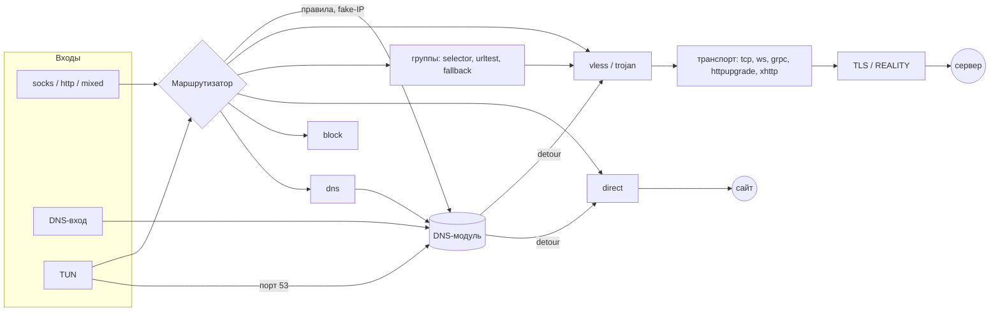

[Русский](ARCHITECTURE.md) | [English](ARCHITECTURE.en.md)

# Как устроено ядро

Техническое описание для тех, кто будет читать, менять или встраивать
ядро: из чего оно состоит, что происходит с соединением от входа до
сервера, где какие решения приняты и почему. Как пользоваться клиентом —
в [README](../README.md); история решений по этапам — в
[PLAN.md](../PLAN.md).

Содержание:

1. [Что это и какие правила соблюдаются](#1-что-это-и-какие-правила-соблюдаются)
2. [Карта репозитория](#2-карта-репозитория)
3. [Общая схема](#3-общая-схема)
4. [Жизненный цикл: запуск, работа, перечитывание, остановка](#4-жизненный-цикл-запуск-работа-перечитывание-остановка)
5. [Настройки](#5-настройки)
6. [Путь TCP-соединения через SOCKS5/HTTP](#6-путь-tcp-соединения-через-socks5http)
7. [UDP](#7-udp)
8. [TUN](#8-tun)
9. [Маршрутизация](#9-маршрутизация)
10. [Выходы](#10-выходы)
11. [Группы серверов и подписки](#11-группы-серверов-и-подписки)
12. [DNS](#12-dns)
13. [Транспорты](#13-транспорты)
14. [Протоколы: VLESS, Vision, XUDP, Mux.Cool, Trojan](#14-протоколы-vless-vision-xudp-muxcool-trojan)
15. [REALITY и TLS-отпечатки](#15-reality-и-tls-отпечатки)
16. [API, учёт соединений и события](#16-api-учёт-соединений-и-события)
17. [Безопасность](#17-безопасность)
18. [Производительность и память](#18-производительность-и-память)
19. [Ошибки и журнал](#19-ошибки-и-журнал)
20. [Платформы](#20-платформы)
21. [Тесты и проверка](#21-тесты-и-проверка)
22. [Как расширять](#22-как-расширять)
23. [Пределы и таймауты](#23-пределы-и-таймауты)

---

## 1. Что это и какие правила соблюдаются

Ядро VPN-клиента на Rust: принимает трафик программ (SOCKS5, HTTP-прокси,
DNS-сервер, TUN), решает по правилам, куда его отправить, и отправляет —
на сервер VLESS или Trojan (с REALITY/TLS, через tcp, ws, grpc,
httpupgrade, xhttp), напрямую или никуда. Сам графический клиент — в
другом проекте; ядро — библиотека `reality-core` и программа
`reality-client` поверх неё.

Правила, которые проходят через весь код:

- **Совместимость проверяется против настоящего Xray-core.** Протоколы,
  транспорты, отпечатки — перенос логики Xray с ссылками на его исходники
  в комментариях; каждая возможность гоняется в тестах против живого
  Xray (`core/tests/interop_xray.rs`, `scripts/smoke_xray.sh`).
- **Ошибка вместо молчания.** Неизвестный ключ настроек, неподдерживаемый
  параметр ссылки, правило, которое никогда не сработает, — ошибка при
  запуске с путём до места, а не молча выброшенная настройка. Сбой,
  который тихо меняет маршрут или снижает защиту, хуже отказа запуститься.
- **Журнал — не история посещений.** Адреса сайтов пишутся только на
  уровне `debug`; наружу они уходят только через API (127.0.0.1 и токен).
- **Секреты отдельно.** UUID, пароли, адреса подписок и токен API можно
  держать в отдельных файлах (`link_file`, `auth_file`, `url_file`,
  `secret_file`); файл настроек тогда можно показывать.
- **Готовые библиотеки там, где цена ошибки высока**: tokio, rustls,
  h2, quinn, async-tungstenite, smoltcp, hickory-proto. Своё — только то,
  чего нет готового или что надо повторить за Xray байт в байт.
- **Без затрат на горячем пути.** Буфер на направление выделяется один
  раз; учёт и события — атомики; всё необязательное (sniffing, события,
  журнал API) выключается целиком, когда не нужно.

## 2. Карта репозитория

Рабочее пространство Cargo:

| Каталог | Крейт | Что это |
|---|---|---|
| `core/` | `reality-core` (библиотека) | всё ядро: протоколы, транспорты, REALITY, приложение |
| `bin/client/` | `reality-client` | программа: ключи командной строки, запуск, служба и системный прокси Windows |
| `bin/fpcheck/` | `fpcheck` | снимает JA3/JA4 того ClientHello, что клиент реально отправляет |
| `ffi/` | `reality-ffi` (`libreality`) | ядро как библиотека: C ABI для приложений ([LIBRARY.md](LIBRARY.md)) |
| `bench/` | `bench` | criterion-замеры и `memwatch` (память процесса под нагрузкой, Linux) |
| `vendor/rustls-reality-patch/` | `rustls` 0.23.45 с патчем | хук REALITY в ClientHello, GREASE, порядок расширений Chrome; подключается через `[patch.crates-io]`; объём и перенос обновлений — [`RUSTLS_PATCH.md`](RUSTLS_PATCH.md) |
| `interop/go-reality-server/` | Go | тестовый REALITY-сервер на библиотеке XTLS/REALITY |

Внутри `core/src/`:

| Модуль | Что делает |
|---|---|
| `app/` | приложение: входы → маршрутизатор → выходы, настройки, DNS, TUN, группы, подписки, API |
| `vless/` | ссылка `vless://` (`uri.rs`), заголовки VLESS (`protocol.rs`), Vision, UDP, XUDP, Mux.Cool |
| `trojan.rs` | заголовок и UDP-пакеты Trojan |
| `transport/` | TCP/TLS/REALITY (`tcp_tls.rs`, `raw.rs`), ws, grpc, httpupgrade, xhttp, общий пул HTTP/2, QUIC, fragment, noises, заголовки браузера |
| `reality/` | REALITY: ключи и SessionId (`auth.rs`), хук в rustls (`hook.rs`), проверка сертификата (`verifier.rs`) |
| `fingerprint/` | ClientHello браузеров (Chrome 133, Firefox 148, Safari 26.3), разбор ClientHello, JA3/JA4 |
| `socks5/` | SOCKS5: приветствие, логин/пароль, UDP-заголовки |
| `relay.rs` | двусторонняя перекачка с таймаутами простоя |
| `net_protect.rs` | метка собственных сокетов клиента (мимо TUN) |
| `http1.rs` | разбор ответа HTTP/1.1 (xhttp, проверки групп, подписки) |
| `error.rs` | тип ошибки ядра |

Остальное: `examples/` — примеры настроек (sing-box, Xray, systemd),
`scripts/` — проверки и интероп (см. [раздел 21](#21-тесты-и-проверка)),
`docs/` — документация, `.github/` — CI и шаблоны.

## 3. Общая схема



Сбоку от этого пути:

- **Tracker** (`app/stats.rs`) — учёт соединений и трафика;
- **шина событий** (`app/events.rs`) — для потоков API;
- **API** (`app/api.rs`) — управление и наблюдение;
- **Controller** (`app/mod.rs`) — перечитывание настроек, группы, подписки.

Ключевые типы:

- `Metadata` — всё, что известно о соединении при выборе выхода: tag
  входа, источник, сеть (tcp/udp), назначение (`Address`: IPv4, IPv6 или
  домен), порт, найденный sniffing'ом домен.
- `Outbound` (трейт) — выход: `connect(meta) → поток`,
  `udp(meta) → UdpSession`; плюс `server()` (адрес сервера — чтобы
  разрешить его заранее) и `as_group()`.
- `UdpSession` — `send(адрес, порт, данные)` и `recv() → (источник, данные)`.
- `AsyncStream` — любой `AsyncRead + AsyncWrite + Send + Unpin`: так
  транспорты и выходы не знают конкретных типов друг друга.
- `Router` — выходы по tag, скомпилированные правила, `final`, DNS;
  `RouterHandle` — текущий маршрутизатор (подменяется при перечитывании).

## 4. Жизненный цикл: запуск, работа, перечитывание, остановка

### 4.1. Программа `reality-client`

`bin/client/src/main.rs`:

1. Разбор ключей (clap). Два способа задать работу:
   - `--config файл.json` — файл настроек ([раздел 5](#5-настройки));
   - ключи `--server`/`--server-file`, `--listen`, `--auth`… — из них
     собирается тот же `Config`: один вход `mixed` и один выход `proxy`.
     Проверка настроек одна на оба способа.
2. Служебные режимы выполняются и выходят сразу: `--check` (только
   проверить настройки), `--service-install`/`--service-uninstall`,
   `--autostart-install`/`--autostart-uninstall`, `--system-proxy-off`,
   `--tun-cleanup`.
3. Журнал (`init_logging`): в stderr или в `--log-file` (больше 10 МБ —
   прежний уходит в `.old`); фильтр — `RUST_LOG`, по умолчанию `info`.
   К журналу подключается `LogLayer` — поток `GET /logs` в API.
4. Рантайм tokio (многопоточный), `App::build(&cfg)` → `start()` →
   `Running`.
5. Дальше ждём одного из двух: вход упал с ошибкой (`Running::wait`) или
   сигнал остановки (Ctrl+C, SIGTERM; на Windows ещё закрытие окна и
   выход из системы). SIGHUP (Unix) — перечитать настройки.
6. Остановка: `Running` уничтожается — входы останавливаются, маршруты TUN
   возвращаются, системный прокси (если включали) возвращается к прежнему.
   Рантайму даётся не больше 2 с на завершение.

### 4.2. `App::build` — всё, что можно проверить до запуска

`core/src/app/mod.rs`:

- `inbound_tags` — tag всех входов (правило с несуществующим входом —
  ошибка).
- `build_core` собирает всё, что пересобирается при перечитывании:
  - проверяет поля выходов и циклы групп (группа не может входить сама в
    себя через другие);
  - раскрывает пресеты (`route.presets`) в правила и наборы правил
    (`rule_set`) в условия правил и DNS;
  - строит выходы по порядку: `vless`/`trojan` (ссылка → `VlessConfig`),
    `direct`, `block`, `dns`, группы;
  - когда все выходы собраны, заполняет участников групп и проверяет
    `default`;
  - создаёт подписки (каждая должна входить хотя бы в одну группу) и
    загружает их сохранённые списки;
  - читает из geosite/geoip только нужные категории;
  - собирает DNS-модуль (если есть раздел `dns`) и маршрутизатор;
  - результат — `Router` и `Core` (DNS, группы, подписки, имена серверов
    для TUN).
- `build_inbounds` — входы: адреса, логины, `allow_ip`, TUN-параметры.
  Вход, открытый в сеть с паролем короче 12 символов, — ошибка.
- API: токен не короче 16 символов; слушать не на loopback — только с
  `allow_ip`.

Ничего не открыто и не запущено: `--check` заканчивается здесь.

### 4.3. `App::start` — порядок важен из-за TUN

1. Провайдер криптографии rustls (aws-lc-rs) — один раз на процесс.
2. Для каждого входа TUN:
   - создаётся интерфейс (нужны права);
   - если включён `auto_route`, пока системный DNS ещё работает напрямую:
     - загружаются подписки без сохранённого списка;
     - заранее разрешаются имена всех серверов (`pre_resolve`), иначе
       после включения маршрутов имя сервера пришлось бы спрашивать у
       DNS, который сам идёт через этот сервер;
     - включаются маршруты (`tun::route::setup`, [раздел 8](#8-tun));
     - ставится «резолвер TUN»: новые имена спрашиваются у DNS-модуля
       клиента, а не у системы.
3. Открываются остальные входы (`start_listener`).
4. Запускаются фоновые задачи: проверки групп, обновление подписок,
   сохранение таблицы fake-IP.
5. Создаётся `Controller`, открывается API.

Каждая фоновая задача запускается через `spawn_task`: её ошибка уходит в
общий канал, и `Running::wait` возвращает её — программа завершится,
а не будет молча работать без входа.

### 4.4. Перечитывание настроек

`Controller::reload(new)` — вызывается `POST /reload`, `PUT /configs`,
SIGHUP, `PUT /config` (новые настройки текстом) или напрямую
(`Running::reload`). Перечитывания идут строго по одному.

`Controller::apply_text` — новые настройки через API:

1. Текст разбирается как есть, и все пути в нём
   (`Config::for_each_path`) проверяются: только относительные без `..`
   (`check_paths_confined`). Иначе держатель токена мог бы заставить
   клиент (службу Windows — от SYSTEM) читать чужие файлы.
2. `Config::parse_at` привязывает пути к папке файла настроек и
   подставляет пути по умолчанию (кеш подписки — `<tag>.subscription`).
   Затем `check_paths_inside`: канонический путь каждого файла (для ещё
   не созданного — ближайшей существующей папки над ним) лежит внутри
   канонической папки настроек — так не пройдут ни символическая ссылка
   наружу, ни тег подписки с `..`.
3. `?check=1` — только `App::build`.
4. Иначе `reload`.
5. Если `save`, текст записывается атомарно (`save_config`): временный
   файл рядом → `rename`; прежний — в `.bak`; права — как у прежнего.

1. Сохранить таблицу fake-IP старого DNS.
2. `build_core` и `build_inbounds` из новых настроек. Любая ошибка —
   возврат ошибки, **ничего не меняется**.
3. Подменить маршрутизатор в `RouterHandle`. Новые соединения идут по
   новым правилам и выходам. Открытые соединения держат `Arc` на старые
   выходы и доживают своё.
4. Остановить старые фоновые задачи и запустить новые (группы, подписки).
5. Входы:
   - те, чьи настройки не изменились (сравнивается строка-ключ), продолжают
     работать;
   - изменившиеся и исчезнувшие останавливаются;
   - новые открываются (до 20 попыток по 50 мс — порт мог ещё не
     освободиться).
6. Не меняются на ходу вход TUN и API; об этом возвращаются замечания
   (`notes`).
7. `Tracker` (учёт, шина событий) переживает перечитывание; отправляется
   событие `reload`.

## 5. Настройки

`core/src/app/config/`:

| Файл | Что делает |
|---|---|
| `mod.rs` | модель `Config`, `Config::parse`/`load`, определение формата, `input_files` |
| `obj.rs` | JSONC, обход объекта с учётом прочитанных ключей, длительности Go |
| `singbox.rs` | формат sing-box → `Config` |
| `xray.rs` | формат Xray-core → `Config` |
| `link.rs` | `LinkBuilder`: поля выхода → ссылка `vless://`/`trojan://` |

### 5.1. Разбор

`Config::parse(text)`:

1. Снять BOM и комментарии: `strip_jsonc` убирает `//`, `/* */` и висячие
   запятые побайтово, не трогая строки (UTF-8 безопасно).
2. Не JSON-объект — ошибка с подсказкой: свой TOML больше не
   поддерживается.
3. Определить формат (`detect`). Это Xray, если у какого-нибудь входа или
   выхода есть ключ `protocol` или в корне есть `routing`, `fakedns`,
   `observatory`, `burstObservatory`, `policy`. Иначе — sing-box.
4. Разобрать соответствующим модулем в общую модель.
5. `root.finish()` — ключи корня, которые никто не прочитал, — ошибка.

`Obj` — обёртка над `serde_json` объектом. Каждый `str()`, `bool()`,
`u64()`, `obj()` запоминает, какой ключ взят. `finish()` сообщает об
оставшихся с путём: `outbounds[1].tls.ech: неизвестные или
неподдерживаемые ключи`. Ключи, начинающиеся с `//`, и `$schema`
пропускаются. Возможность, которую ядро знает, но не поддерживает,
отвергается явно: `unsupported(key, что)`.

### 5.2. Модель

```text
Config
├── inbounds: Vec<InboundConfig>      kind (socks/http/mixed/dns/tun), listen, auth, allow_ip,
│                                     max_conns, sniff, sniff_override_destination,
│                                     tun: имя, адреса, mtu, auto_route, route_exclude,
│                                     strict_route, dns_hijack
├── outbounds: Vec<OutboundConfig>    tag, kind (vless/trojan/direct/block/dns/selector/
│                                     urltest/fallback), link | link_file, ca_file, xudp,
│                                     allow_insecure, mux, fragment, noises,
│                                     группы: outbounds, subscriptions, url, interval,
│                                     tolerance, default
├── route: RouteConfig                rules, final, rule_set, presets, geosite/geoip_file,
│                                     domain_strategy
├── dns: Option<DnsConfig>            servers, rules, final, strategy, fakeip, кеш
├── subscriptions: Vec<…>             tag, url | url_file, update_interval, detour, …
└── api: Option<ApiConfig>            listen, token | token_file, allow_ip
```

Модель — внутренняя: её заполняют только два разборщика, а пользуется
всё остальное ядро. Новые форматы (например, Clash YAML) добавляются
третьим разборщиком без изменений в остальном коде.

### 5.3. Выходы как ссылки

Поля выхода `vless`/`trojan` (сервер, uuid, tls, reality, transport…)
`LinkBuilder` собирает в ссылку `vless://…`/`trojan://…`, которая
проходит тот же разбор (`VlessConfig::parse`), что ссылка из командной
строки и серверы из подписок. Одна проверка на все три источника:
неподдерживаемый `security`/`type`/`flow` — одна и та же понятная
ошибка.

### 5.4. Соответствия форматов

- **sing-box.**
  - Действия правил: `route`, `reject` → скрытый выход `__reject` (block),
    `hijack-dns` → скрытый выход `__hijack_dns` (dns), `sniff` → sniffing
    у входов.
  - DNS-серверы с `type` и старая форма `address`.
  - У tun: `address`/`route_exclude_address` и старые `inet4_*`.
  - `experimental.clash_api` → API.
  - Вход `direct` без правила `hijack-dns` на его tag — ошибка: такой
    вход в ядре бывает только DNS-сервером.
- **Xray.**
  - Входы — по `protocol`: `dokodemo-door` становится DNS-сервером, только
    если маршрутизация отдаёт его выходу `dns`.
  - `vnext`/`servers` или плоские `settings`; `streamSettings`;
    `realitySettings` (`publicKey` или `password`).
  - Домены в `routing`: `geosite:`, `domain:`, `full:`, `regexp:`,
    `keyword:`, просто подстрока.
  - `balancers` (`leastPing`/`leastLoad`) → `urltest`, адрес и период
    проверки — из `observatory`.
  - DNS: серверы с `domains` → правила DNS, `+local` → через первый
    `freedom`; `fakedns` → fake-IP; `mux` → Mux.Cool;
    `sniffing.routeOnly` → без подмены назначения.
- **Расширения ядра** (нет в обоих форматах):
  - `link`/`link_file`, `allow_insecure`, `mux`, `fragment` у выходов;
  - `fragment`/`noises` у `direct`;
  - выход `fallback`;
  - `subscriptions` (в корне и у групп);
  - `allow_ip`/`max_conns` у входов;
  - `route.presets`, `geosite_file`, `geoip_file`, `domain_strategy`;
  - `cache_file` у fake-IP; `secret_file`/`allow_ip` у `clash_api`.

### 5.5. Пути и секреты

Относительные пути — от папки файла настроек (`Config::load` запоминает
её). `Config::input_files` — список файлов, на которые ссылаются
настройки; по нему служба Windows копирует их в защищённую папку
([раздел 20](#20-платформы)). Секреты из файлов читаются
`read_secret_file` (обрезаются пробелы и переводы строк).

## 6. Путь TCP-соединения через SOCKS5/HTTP

`app/proxy_in.rs` (`ProxyInbound`), `app/http_in.rs`, `socks5/`.

1. **accept.**
   - Адрес не из `allow_ip` или временно заблокирован за подбор пароля —
     соединение закрывается сразу, до разбора.
   - Нет свободного места (`max_conns`, по умолчанию 512) — закрывается,
     предупреждение в журнал не чаще раза в 10 с.
   - `TCP_NODELAY`.
2. **Приветствие** (не дольше 10 с): по первому байту `0x05` — SOCKS5,
   иначе HTTP (у `mixed` оба на одном порту).
   - SOCKS5 — RFC 1928: без пароля или логин/пароль RFC 1929; команды
     `CONNECT` и `UDP ASSOCIATE`. Неверный пароль — пауза 500 мс, после 5
     подряд адрес блокируется от 60 с до часа (растёт).
   - HTTP — `CONNECT host:port` (туннель) или обычный запрос
     `GET http://…`. Во втором случае строка запроса переписывается в
     `GET /path`, заголовки прокси убираются и добавляется
     `Connection: close`: одно соединение с прокси — один запрос к одному
     сайту.
3. **Metadata**: вход, источник, `tcp`, назначение, порт.
4. **Sniffing** — только если он включён и приложение прислало IP, а не
   имя:
   - ответ «соединено» уходит сразу, иначе приложение не пришлёт первых
     байт;
   - `sniff::read_and_sniff` ждёт до 300 мс и читает до 16 КиБ;
   - домен берётся из SNI TLS ClientHello или из `Host` HTTP;
   - прочитанные байты сохраняются и потом отправляются как есть;
   - с `sniff_override` назначение заменяется найденным доменом (имя
     разрешит сервер).
5. **Маршрут**: `router.route(&mut meta)` ([раздел 9](#9-маршрутизация)).
6. **Выход**: `router.dial(outbound, meta)`:
   - `outbound.connect(meta)` открывает поток;
   - поток оборачивается в `Counted` — счётчики трафика
     ([раздел 16](#16-api-учёт-соединений-и-события));
   - соединение регистрируется в `Tracker`.
7. **Ответ приложению**: успех или код ошибки (SOCKS5 REP, HTTP 502/403).
   `Error::Blocked` (выход `block`) — отказ без записи в журнал.
8. **Первые байты** (прочитанные sniffing'ом или тело HTTP-запроса)
   записываются в поток выхода.
9. **Перекачка**: `relay::copy_bidirectional` — одновременно с ожиданием
   отмены через API (`DELETE /connections/{id}`).

`relay.rs`:

- каждое направление — свой цикл `read`/`write_all` с буфером 17 КиБ,
  выделенным один раз;
- 17, а не 16 КиБ, потому что целый TLS-рекорд с заголовком и тегом
  больше 16 КиБ, а Vision переключается на прямую передачу, только видя
  целые рекорды;
- EOF с одной стороны передаётся как `shutdown` другой;
- соединение закрывается, если 300 с не шло ни байта в обе стороны или
  30 с после EOF одной из сторон (как `connIdle`/`uplinkOnly` у Xray).

## 7. UDP

### 7.1. SOCKS5 UDP ASSOCIATE

`proxy_in::udp_associate`:

- Клиент получает UDP-порт; принимаются датаграммы только от владельца
  ассоциации (адрес TCP-управляющего соединения).
- Каждая датаграмма маршрутизируется отдельно. На каждый выбранный выход
  открывается своя `UdpSession`, не больше 256 на ассоциацию. Ответы всех
  сессий уходят владельцу.
- Ассоциация живёт, пока открыто TCP-соединение управления.

### 7.2. UDP-сессии выходов

- **vless, XUDP** (по умолчанию, как у клиента Xray): один VLESS-поток с
  командой Mux на все назначения. Даёт Full Cone NAT и одно рукопожатие
  на все назначения; с Vision-аккаунтом Xray принимает UDP только так.
  Подробнее — [раздел 14](#14-протоколы-vless-vision-xudp-muxcool-trojan).
- **vless, поток на назначение** (`xudp: false`): команда UDP, одна пара
  «источник — назначение» на поток; для серверов без XUDP. Не больше 256
  назначений и 4 МиБ в очередях на сессию.
- **trojan**: один поток с командой UDP на сессию, внутри — пакеты к
  любым адресам.
- **direct**:
  - свои сокеты IPv4 и IPv6 (с меткой `net_protect`);
  - имена разрешаются своим DNS-модулем (или системой) и запоминаются на
    время сессии;
  - `noises` — пакеты-пустышки перед первой датаграммой к адресу.
- **dns**: датаграммы — DNS-запросы, ответ формирует DNS-модуль.

Сессия закрывается после 120 с без пакетов (`UDP_IDLE`).

## 8. TUN

`app/tun/` — виртуальный интерфейс, как у VPN: через клиент идёт трафик
всех программ.

### 8.1. Устройство и стек

- Интерфейс создаёт `tun-rs`. На Windows нужен `wintun.dll` рядом с exe.
  Адреса по умолчанию `172.19.0.1/30` и `fdfe:dcba:9876::1/126`; MTU из
  настроек.
- Если у компьютера нет IPv6, IPv6 в TUN не направляется: иначе
  программы ждали бы таймаута IPv6 вместо того, чтобы сразу пойти по
  IPv4.
- **Свой TCP/IP-стек** — smoltcp через `netstack-smoltcp`:
  - `pump` перекачивает пакеты между устройством и стеком (очереди по
    4096 пакетов);
  - стек отдаёт TCP-соединения и UDP-датаграммы;
  - окно TCP к приложению — 256 КиБ. Пропускная способность одного
    соединения — окно ÷ RTT; память под буфер система выделяет лениво,
    по мере записи.
- До smoltcp был ipstack: соединения вставали после потери пакетов. Замена
  описана в PLAN.md.

### 8.2. Соединения

- **TCP**:
  - соединение с приложением принимается стеком сразу;
  - широковещательные, групповые адреса и адреса самой подсети TUN
    отбрасываются;
  - порт 53 при `dns_hijack` (правило `hijack-dns`) отвечает DNS-модуль;
  - дальше как у SOCKS5: sniffing (SNI/Host), `router.route`,
    `router.dial`, `relay`.
- **UDP** (`tun/udp.rs`):
  - датаграммы раскладываются по потокам, по одному на пару
    «приложение — назначение»;
  - поток закрывается сам после 120 с тишины;
  - ответ приложению уходит «от» того адреса, куда оно отправляло, в
    том числе от fake-IP;
  - порт 53 при перехвате отвечает DNS-модуль;
  - остальное: sniffing QUIC (`sniff_quic.rs`), маршрут,
    `outbound.udp()`, перекачка датаграмм.
- **Sniffing QUIC**:
  - ключи Initial-пакетов выводятся из Destination Connection ID, который
    виден открытым текстом;
  - снимается защита заголовка, пакет расшифровывается (AES-128-GCM);
  - CRYPTO-кадры собираются по смещению из нескольких датаграмм (Chrome с
    ML-KEM кладёт ClientHello в два пакета и перемешивает кадры);
  - ClientHello разбирается тем же кодом, что для TCP;
  - поддерживаются QUIC v1 и v2; второй пакет ждём не дольше 300 мс.
- ICMP (ping) через TUN не проходит.

### 8.3. `auto_route` и защита от петли

Собственные соединения клиента (к серверу, `direct`, DNS-серверы) не
должны попадать в TUN, иначе петля. `net_protect.rs` создаёт для них
сокеты с защитой, а `tun/route.rs` ставит маршруты.

- **Linux** (как у sing-box):
  - таблица 2022 с маршрутом по умолчанию через TUN;
  - правила `ip rule`:
    - `fwmark 0x7e2 → main` (pref 9000) — помеченные сокеты клиента
      (`SO_MARK`) идут обычным путём;
    - подсети `route_exclude` → `main`;
    - всё остальное → таблица 2022 (pref 9001);
  - если клиент убит, интерфейс исчезает вместе с маршрутами, и трафик
    снова идёт по `main`;
  - `strict_route` (kill switch): после таблицы TUN стоит `unreachable`
    (pref 9002). Убитый клиент оставляет сеть закрытой, кроме
    `route_exclude`, до нового запуска или `--tun-cleanup`;
  - свои правила и маршруты помечены протоколом 202 (`protocol` у
    `ip rule`, `proto` у `ip route`); снимается только помеченное, а чужие
    записи на приоритетах 9000–9002 или в таблице 2022 (`ip -N -j`) —
    отказ включать `auto_route` с их списком.
- **Windows**:
  - маршруты `0.0.0.0/1` и `128.0.0.0/1` (и `::/1`, `8000::/1`) через TUN.
    Они точнее маршрута по умолчанию, поэтому его не нужно трогать;
  - сокеты клиента привязаны к физическому интерфейсу (`IP_UNICAST_IF`);
  - DNS интерфейса — соседний адрес в подсети TUN: запрос к нему уйдёт в
    TUN и будет перехвачен;
  - маршруты живут, пока жив интерфейс;
  - `strict_route` (kill switch) — стойкие фильтры WFP (`tun/wfp.rs`), как
    у WireGuard и Mullvad. Свой подслой наивысшего веса на уровнях ALE
    connect и recv-accept (IPv4, IPv6); в нём фильтры по весу:
    1. разрешить сам клиент (по exe, `FWPM_CONDITION_ALE_APP_ID`);
    2. разрешить loopback;
    3. разрешить интерфейс TUN (по LUID);
    4. разрешить `route_exclude`, DHCP, для IPv6 — ICMPv6 (NDP), DHCPv6,
       link-local;
    5. запретить остальное.

    Фильтры `PERSISTENT` переживают сбой и перезагрузку. Ключи —
    постоянные GUID, поэтому снять их можно откуда угодно, ничего не
    запоминая: при штатной остановке (`RouteGuard`), при новом запуске
    (перед установкой) и `--tun-cleanup`. После сбоя TUN исчезает, и
    открытыми остаются только `route_exclude` и служебное. Первые
    секунды после включения Windows ещё «опознаёт» интерфейс TUN и шлёт
    DNS-запросы на серверы физического адаптера — фильтры их закрывают;
    затем имена разрешаются через TUN (живой тест ждёт этого, `Wait-Dns`).
- **Один владелец `auto_route`** (`route::HostLock`). Таблица, приоритеты
  правил и GUID фильтров общие у всех экземпляров, поэтому их держит
  один процесс: на Linux — абстрактный сокет Unix
  `reality-client/auto_route` (в сетевом пространстве, как и маршруты), на
  Windows — `auto_route.lock` в папке службы `%ProgramData%\RealityClient`
  (права только у SYSTEM и администраторов; `route::set_lock_dir`, клиент
  готовит папку только при `auto_route` и `--tun-cleanup`), открытый без
  общего доступа. Блокировка берётся до создания интерфейса и живёт в
  `RouteGuard`; ОС снимает её вместе с процессом, так что занятая
  блокировка — всегда живой экземпляр: второй выходит с ошибкой, а
  `--tun-cleanup` отказывается.
- **Имена при включённом TUN**. Системный резолвер сам идёт через TUN и
  мог бы получить fake-IP. Поэтому:
  - адреса серверов разрешаются заранее и кешируются: 120 с свежие, до
    часа — если DNS не отвечает;
  - обновление кеша идёт в фоне, по одному на имя;
  - новые имена спрашиваются у DNS-модуля напрямую
    (`set_tun_resolver`).
- Системный DNS-сервер (`type: local`) вместе с TUN — ошибка настроек,
  потому что это петля.

## 9. Маршрутизация

`app/router.rs`, `app/rules.rs`, `app/geo.rs`, `app/ruleset.rs`.

### 9.1. `Router::route`

1. **Fake-IP → имя.** Если назначение — адрес из диапазона fake-IP, он
   заменяется исходным именем. Адрес из диапазона без известного имени
   (например, таблица устарела после перезапуска без `cache_file`) —
   ошибка соединения, а не запрос «в никуда».
2. **Режим** (как в Clash, `Tracker::mode`): в `global` всё идёт через
   выбранного в группе `GLOBAL` участника, в `direct` — через первый
   `direct`; правила не проверяются, кроме правил перехвата DNS (иначе
   DNS-запросы ушли бы на сервер как обычный трафик). Группа `GLOBAL`
   (selector из всех выходов, по умолчанию `route.final`) создаётся в
   `build_core`, если своей с таким tag нет. Режим меняют `PATCH /configs`
   и `clash_api.default_mode`; он переживает перечитывание.
3. **Правила по порядку**, срабатывает первое подошедшее. Описание
   сработавшего правила (`rules::describe`: `domain_suffix=ru su
   geoip=ru`, длинные списки сокращены; наборы правил — по tag, ещё до их
   раскрытия) пишется в `Metadata::rule` — его видно в `/connections` и
   `/rules`.
4. **`domain_strategy`: `ip_if_non_match`.** Если ни одно правило не
   подошло, назначение — имя, а среди правил есть правила по IP, имя
   разрешается DNS-модулем и правила проверяются ещё раз для каждого
   адреса.
5. Иначе — `route.final`; если он не задан, первый выход.

### 9.2. Правило

Условия одного правила, как у sing-box:

```text
(домен ИЛИ адрес)  И  порт  И  сеть  И  вход
```

- Внутри группы — «или»: `"domain_suffix": ["ru", "su"]` означает `.ru`
  или `.su`. `geosite` и `geoip` в одном правиле означают «российский
  сайт или российский адрес».
- Незаданная группа условий не проверяется.
- Доменные условия проверяются по назначению-имени или по найденному
  sniffing'ом имени. Адресные — только если назначение — IP.
- **Компиляция** (`rules::compile`):
  - точные домены и суффиксы — в хеш-множества; суффикс ищется среди
    самого имени и всех его «родителей» (`a.b.ru` → `b.ru` → `ru`);
  - ключевые слова — подстроки;
  - регулярные выражения — `regex` с ограничением размера (64 МиБ);
  - подсети — списки `IpNet` отдельно для IPv4 и IPv6.
- **geosite/geoip** (`geo.rs`): свой минимальный разбор protobuf из
  формата v2fly. Из файла берутся только категории, которые упомянуты в
  правилах, остальное отбрасывается при чтении: обе базы целиком — около
  0,2 с, в памяти — только нужное.
- **Наборы правил sing-box** (`ruleset.rs`):
  - поддерживаются `.srs` (бинарный: «SRS», версия, zlib, домены в сжатом
    префиксном дереве, адреса диапазонами) и исходный `.json`;
  - содержимое добавляется к доменам и адресам правила;
  - наборы с условиями, которых нет в ядре (порт, процесс, логические
    `and`/`or`, `invert`), — ошибка: молча упростить их значило бы
    маршрутизировать не так, как задумано;
  - формат сверен с исходниками sing-box и с `sing-box rule-set decompile`
    на настоящих наборах.
- **Пресеты** раскрываются в правила после своих, так что свои правила
  их переопределяют:
  - `block-ads` — geosite `category-ads-all` → первый `block`;
  - `private-direct` — частные сети, `.local`, `.lan` → первый `direct`;
  - `ru-direct`, `cn-direct`, `ir-direct` — домены страны, geosite и
    geoip → `direct`.

## 10. Выходы

`app/outbound.rs`, `app/vless_out.rs`, `app/trojan_out.rs`, `app/group.rs`.

| Выход | TCP | UDP |
|---|---|---|
| `direct` | разрешить имя (свой DNS или система), подключиться по адресам по очереди (10 с на адрес, 30 с всего); `fragment` | свои сокеты IPv4/IPv6, `noises` |
| `block` | `Error::Blocked` | `Error::Blocked` |
| `dns` | DNS поверх TCP → DNS-модуль | датаграммы → DNS-модуль (до 64 одновременно) |
| `vless` | VLESS-поток через транспорт; с `mux` — Mux.Cool | XUDP или поток на назначение |
| `trojan` | Trojan-поток через те же транспорты | один поток с командой UDP |
| группы | участник по стратегии, при ошибке — следующий (до трёх) | так же |

- **`direct` и адреса этого компьютера.** Клиент из сети не может
  соединиться через `direct` с `127.0.0.1`, `localhost` или адресом
  «любой». Проверяется по фактическому адресу после разрешения имени:
  иначе прокси, открытый в сеть, отдавал бы соседям службы, слушающие
  только loopback.
- **`vless`**: `transport::dial` с общим потолком 30 с на рукопожатие.
  - Адрес сервера — из кеша ([раздел 8.3](#83-auto_route-и-защита-от-петли)).
  - Mux.Cool (`mux: N`): пул потоков; соединение открывается в потоке, где
    меньше N соединений, иначе открывается новый поток (по одному
    одновременно). Не вместе с Vision — проверяется при сборке.
- Если вместо REALITY-сервера ответил настоящий сайт (сертификат не
  проходит проверку REALITY), клиент не обрывает рукопожатие, а ведёт себя
  как браузер (`browser_mimic.rs`): один запрос главной страницы с
  заголовками Chrome, дочитать ответ, закрыть. Ни UUID, ни заголовок VLESS
  по такому соединению не уходят.

## 11. Группы серверов и подписки

### 11.1. Группы (`app/group.rs`)

Группа — тоже `Outbound`. У неё есть участники из настроек (`fixed`) и
из подписок (`dynamic`, по tag подписки) и текущий участник.

- **`selector`**:
  - текущий — выбранный через API, иначе `default`, иначе первый;
  - ручной выбор — `PUT /groups/{tag}`.
- **`urltest`**:
  - участники сортируются по задержке;
  - текущий остаётся, пока жив и хуже лучшего не больше чем на
    `tolerance` (по умолчанию 50 мс) — без «прыжков»;
  - Xray `balancers` становятся этим.
- **`fallback`**: живые по порядку, упавшие — в конце (вдруг ожили).
- **Проверка** (`check_all`):
  - HTTP-запрос через каждого участника к `url` (по умолчанию
    `https://www.gstatic.com/generate_204`), до 8 одновременно;
  - раз в `interval` со случайным разбросом ±20 %, потому что ровный ритм
    сам по себе признак для DPI;
  - после проверки — событие `group_check`.
- **Пассивный учёт**:
  - участник, через которого соединение не открылось, помечается упавшим
    до следующей проверки;
  - соединение пробует следующего, до трёх;
  - ожившему сбрасывается задержка;
  - смена текущего — событие `group_switch`.
- Переключение не рвёт открытые соединения.

### 11.2. Подписки (`app/subscription.rs`)

- **Загрузка**:
  - `http_client` через выход: через группу, в которую входит подписка,
    а пока список пуст — через `direct` (или `detour`);
  - только HTTPS с проверкой сертификата (`ca_file` — свой корень для
    панели);
  - не больше 4 МиБ, 30 с;
  - User-Agent `v2rayN/7.10.0`, как ждут панели.
- **Форматы**:
  - base64-список ссылок (3x-ui, Marzban, Remnawave), обычный текст, JSON
    sing-box, YAML Clash;
  - берутся VLESS и Trojan, остальное в журнале счётчиком;
  - `include`/`exclude` — регулярные выражения по имени сервера;
  - серверы с `security=none` пропускаются без `allow_insecure`.
- **Применение**:
  - серверы становятся участниками групп с tag `<подписка>/<имя>`;
  - прежние участники с тем же tag сохраняют историю задержек.
- **Кеш**:
  - последний рабочий список хранится в `<tag>.subscription` рядом с
    настройками (права 600, в нём UUID);
  - клиент стартует без панели;
  - обновление по расписанию: `update_interval` (по умолчанию 12 ч) с
    разбросом ±10 %;
  - после ошибки повтор через минуту, пока списка нет, иначе через
    5 минут;
  - каждое обновление — событие `subscription_update`.
- В журнал попадает только имя сервера панели, не адрес подписки: в нём
  токен.

## 12. DNS

`app/dns/` (`mod.rs`, `upstream.rs`, `cache.rs`, `fakeip.rs`), вход —
`app/dns_in.rs`.

Кто пользуется DNS-модулем:

- DNS-вход (UDP и TCP на одном адресе) — DNS-сервер для системы;
- перехват DNS в TUN и выход `dns`;
- выход `direct` — разрешает имена им, а не системой;
- маршрутизатор — fake-IP и `ip_if_non_match`;
- резолвер TUN.

### 12.1. Обработка запроса (`Dns::handle`)

1. Не `QUERY` → `NOTIMP`; не один вопрос → `FORMERR`.
2. Имя нормализуется: нижний регистр, без точки в конце.
3. **Сервер** (`pick`): правила DNS по порядку (те же доменные условия и
   geosite, что у маршрутизатора, плюс `rule_set`), иначе `final`.
4. Сервер `fakeip`:
   - `A`/`AAAA` — сразу адрес из диапазона с TTL 1;
   - `HTTPS`/`SVCB` — пустой ответ, потому что в них настоящие адреса
     (`ipv4hint`) и они обошли бы fake-IP;
   - остальные типы — у настоящего сервера.
5. `strategy` (`ipv4_only`, `ipv6_only`, `prefer_ipv4`, `prefer_ipv6`):
   ненужный тип получает пустой ответ.
6. Кеш по ключу «сервер + имя + тип», затем запрос к серверу.
7. Весь запрос — не дольше 10 с; ошибка или таймаут → `SERVFAIL`.

### 12.2. Серверы (`upstream.rs`)

| Тип | Как |
|---|---|
| `udp` | попытки по 2,5 с; ответ проверяется: номер, флаг ответа, вопрос (имя и тип) и адрес сервера — иначе отбрасывается (защита от подмены) |
| `tcp` | длина впереди, 8 с |
| `tls` (DoT, 853) | rustls с проверкой сертификата |
| `https` (DoH) | HTTP/2 `POST application/dns-message`, путь по умолчанию `/dns-query` |
| `quic` (DoQ, RFC 9250) | quinn; через выход VLESS идёт по XUDP |
| `local` | системный резолвер |
| `fakeip` | см. ниже |

- Запросы к серверу идут через `detour`, по умолчанию через `route.final`,
  то есть обычно через сервер VLESS. Так ни провайдер, ни соседи по Wi-Fi
  не видят, какие имена спрашиваются.
- Через выход `dns` ходить к DNS-серверу нельзя: это петля, проверяется
  при сборке.
- `udp` и `tcp` требуют IP сервера, потому что имя самого DNS-сервера
  разрешить нечем.

### 12.3. Кеш (`cache.rs`)

- Срок записи — наименьший TTL ответа, не дольше часа. Отрицательные
  ответы (пустой, NXDOMAIN) — по SOA, не дольше минуты.
- До 4096 записей (`cache_capacity`). При переполнении уходят сначала
  просроченные, потом самые старые.
- `disable_cache` выключает кеш.

### 12.4. Fake-IP (`fakeip.rs`)

- Диапазоны `198.18.0.0/15` и `fc00::/18`.
- Одно имя — один номер: IPv4- и IPv6-адрес имени — это база диапазона
  плюс тот же номер.
- Номера выдаются по кругу; когда диапазон исчерпан, номер самой давно
  выданной записи переходит к новому имени.
- Обратное преобразование (`reverse`) — для маршрутизатора.
- `cache_file`: таблица сохраняется раз в 30 с (если менялась) и при
  перечитывании, чтобы адреса, которые программы уже запомнили, работали
  после перезапуска.

### 12.5. DNS-вход (`dns_in.rs`)

- UDP и TCP на одном адресе; до 256 запросов одновременно.
- UDP-ответ не длиннее размера, который клиент заявил в EDNS (без EDNS —
  512 байт, RFC 1035); длиннее — усечённый ответ с флагом TC, и клиент
  повторит по TCP. TCP-соединение живёт 30 с без запросов.
- Открытый в сеть DNS-вход без `allow_ip` — ошибка: это «открытый
  резолвер» для DDoS-атак с подменой адреса.

## 13. Транспорты

`transport/`. Вход — `transport::dial(cfg, uuid, команда, адрес, порт)`
(VLESS-сессия) или `transport::open(cfg)` (только транспорт — для Trojan).
Выбор по `type=` ссылки:

| `type` | Файл | Как |
|---|---|---|
| `tcp`/`raw` | `tcp_tls.rs`, `raw.rs` | TCP → TLS/REALITY → VLESS (+Vision) |
| `ws` | `ws.rs` | TLS → WebSocket (async-tungstenite) → поток байт (ws_stream_tungstenite) |
| `grpc` | `grpc.rs`, `h2pool.rs` | HTTP/2 (h2), путь `/{serviceName}/Tun`, кадры gRPC вокруг `Hunk { bytes data = 1 }` |
| `httpupgrade` | `httpupgrade.rs` | HTTP/1.1 Upgrade, после `101` — сырые байты |
| `xhttp` | `xhttp.rs`, `h2pool.rs`, `quic.rs` | обычные HTTP-запросы: `stream-one`, `stream-up`, `packet-up`; HTTP/1.1, HTTP/2 или HTTP/3 |

### 13.1. TCP, TLS, REALITY

- **Подключение** (`tcp_tls.rs`):
  - адреса сервера — из кеша или DNS;
  - подключение по адресам по очереди, 10 с на адрес;
  - сокет — через `net_protect`, `TCP_NODELAY`;
  - рукопожатие — не дольше 15 с.
- **`security`**:
  - `none` — без шифрования; только с `allow_insecure`;
  - `tls` — rustls с проверкой цепочки: встроенные корни webpki или свой
    `ca_file`; ALPN по умолчанию;
  - `reality` — [раздел 15](#15-reality-и-tls-отпечатки).
- **ClientHello** — браузерный профиль по `fp=`
  ([раздел 15](#15-reality-и-tls-отпечатки)).
- **`RawConn`** (`raw.rs`) — прослойка над `TcpStream`:
  - в режиме `record_aligned` (для Vision) она отдаёт rustls байты строго
    в пределах одного TLS-рекорда за вызов;
  - иначе rustls расшифровал бы сырые байты после переключения Vision как
    внешний TLS и порвал бы соединение;
  - без Vision — тонкая прослойка без копирования.
- **`fragment`** (`fragment.rs`) против DPI, который не собирает TCP-поток:
  - режет первый TLS-рекорд с ClientHello на рекорды по `length` байт;
  - с `interval > 0` — ещё и на TCP-сегменты с паузами;
  - или режет 1–3-ю записи в соединение;
  - длины и паузы случайные из диапазонов; по умолчанию выключено.

### 13.2. HTTP-транспорты

- **Заголовки браузера** (`browser_headers.rs`) — того же браузера, чей
  ClientHello изображается: TLS Firefox с User-Agent Chrome у настоящих
  браузеров не бывает.
  - Версия Chrome вычисляется от даты, как у Xray: 144 на 2026-01-13, +1
    каждые 35 дней, со случайным отставанием до ~105 дней.
  - Значение выбирается один раз на процесс.
- **Общие HTTP/2-соединения** (`h2pool.rs`, как `xmux` у Xray):
  - несколько VLESS-сессий — потоки одного соединения;
  - соединение не используется, если закрыто или исчерпало пределы:
    сессий (`cMaxReuseTimes`), запросов (`hMaxRequestTimes`), времени
    (`hMaxReusableSecs`);
  - новое соединение открывается, если подходящих нет или их меньше
    `maxConnections`;
  - пределы каждого соединения выбираются случайно из диапазонов, потому
    что ровные числа — признак;
  - пустое соединение закрывается по таймауту.
  - Для gRPC (у Xray — общий `ClientConn`) и xhttp (умолчания Xray: 16–32
    сессии, 600–900 запросов, 1800–3000 с на соединение).
- **xhttp**:
  - версия HTTP — как `decideHTTPVersion` у Xray: REALITY → h2; без TLS →
    HTTP/1.1; TLS → h2, либо HTTP/1.1 при `alpn=http/1.1`, либо HTTP/3 при
    `alpn=h3`;
  - маскировка:
    - `Referer` с `x_padding` случайной длины (100–1000 по умолчанию);
    - `Content-Type: application/grpc` у потоковых POST;
  - параметры из `extra=` (JSON, как в ссылках Xray);
  - настройки, меняющие формат запросов (`xPaddingObfsMode`,
    `downloadSettings` и т.п.), — ошибка, а не молчаливая поломка.
- **QUIC** (`quic.rs`, quinn):
  - нужен для xhttp через HTTP/3 и DoQ;
  - сокет — настоящий UDP (с `net_protect`) или UDP-сессия выхода, то
    есть QUIC может идти через VLESS.

## 14. Протоколы: VLESS, Vision, XUDP, Mux.Cool, Trojan

### 14.1. VLESS (`vless/protocol.rs`)

```text
запрос:  версия(1)=0 | UUID(16) | длина доп.(1)=0 | команда(1: 1 TCP, 2 UDP, 3 Mux) |
         порт(2) | тип адреса(1: 1 IPv4, 2 домен, 3 IPv6) | адрес | данные…
ответ:   версия(1) | длина доп.(1) | доп. | данные…
```

- Заголовок запроса отправляется сразу после рукопожатия; с Vision — вместе
  с первым блоком.
- Ответа сервера клиент не ждёт, прежде чем слать данные: Xray-сервер
  присылает заголовок ответа только вместе с первыми данными от сайта, а
  сайт (HTTPS) молчит, пока клиент ничего не прислал. Заголовок ответа
  снимается и проверяется при первом чтении (`VlessStream`).

### 14.2. XTLS Vision (`vless/vision.rs`)

Перенос `proxy/proxy.go` Xray с тем же порядком решений:

1. **Padding.** Первые пакеты в обе стороны заворачиваются в блоки
   `[UUID] команда длина_данных длина_padding данные padding`. Это прячет
   характерные длины рукопожатия «TLS в TLS». Если приложение 500 мс
   молчит, уходит блок из одного padding.
2. **Распознавание внутреннего TLS** по первым пакетам (до 8):
   ClientHello приложения, ServerHello сайта. TLS 1.3 с обычным AEAD →
   XTLS.
3. **Прямая передача.** С началом прикладных данных внутреннего TLS
   сторона отправляет блок `Direct` и дальше пишет байты внутреннего TLS
   прямо в TCP, без второго шифрования. Направления переключаются
   независимо. Чтение внешнего TLS идёт по одному рекорду (`RawConn`).

Только `type=tcp` с `tls`/`reality`, как у Xray.

### 14.3. UDP поверх VLESS

- **XUDP** (`vless/xudp.rs`):
  - поток с командой Mux на `v1.mux.cool:666`;
  - внутри — кадры Mux.Cool сессии 0, у каждого пакета свой адрес;
  - `GlobalID` (8 байт) — сервер по нему сохраняет тот же внешний UDP-порт
    при переоткрытии потока. Здесь он случайный на ассоциацию.
- **Команда UDP** (`vless/udp.rs`): поток на назначение, пакеты
  `длина(2) + данные`.

### 14.4. Mux.Cool для TCP (`vless/mux.rs`)

Несколько соединений приложения в одном VLESS-потоке:

```text
длина метаданных(2) | ID(2) | статус(1: New, Keep, End, KeepAlive) | опции(1) |
[New: сеть(1) порт(2) адрес] | [данные: длина(2) данные]
```

- Как у Xray: не больше `concurrency` соединений одновременно и 128 за
  жизнь потока; поток без соединений закрывается через 16 с.
- Полузакрытие не передаётся.
- Цена: все соединения делят одно окно TCP.

### 14.5. Trojan (`trojan.rs`, `app/trojan_out.rs`)

```text
hex(SHA-224(пароль))(56) CRLF | команда(1: 1 TCP, 3 UDP) | адрес как в SOCKS5 | порт CRLF | данные…
UDP-пакет: адрес | порт | длина(2) | CRLF | данные
```

- Ответа у сервера нет, дальше сразу идут данные.
- Транспорты и TLS/REALITY — те же, что у VLESS.

## 15. REALITY и TLS-отпечатки

### 15.1. Почему свой rustls

REALITY требует того, чего обычный TLS-стек не даёт:

- тот же эфемерный X25519-ключ идёт и на аутентификацию перед
  REALITY-сервером, и на настоящий обмен ключами TLS 1.3;
- SessionId шифруется ключом, который зависит от `ClientHello.random`, а
  дополнительные данные AEAD — байты самого ClientHello;
- сертификат проверяется HMAC-ом, а не цепочкой доверия.

Для этого в `vendor/rustls-reality-patch` добавлен хук
`RealityClientHook`, который встраивается в сборку ClientHello
(`emit_client_hello_for_retry`):

1. подставляет свой key_share;
2. уже зная `random`, шифрует SessionId и вписывает его в сообщение;
3. отдаёт сырые ClientHello/ServerHello для проверки ML-DSA.

Патч подключается к графу зависимостей целиком через `[patch.crates-io]`.

### 15.2. Клиентская сторона (`reality/`)

- **`auth.rs`**:
  - X25519 ECDH с открытым ключом сервера (`pbk=`);
  - HKDF-SHA256 даёт AuthKey;
  - AES-256-GCM шифрует SessionId: версия клиента, время, ShortId
    (`sid=`);
  - байт в байт сверено с `reality.go` из Xray-core.
- **`hook.rs`**:
  - key_share — гибрид X25519MLKEM768 (как требуют современные серверы
    Xray) плюс отдельная доля X25519 с тем же ключом, чтобы сайт-приманка
    без ML-KEM мог ответить;
  - секреты стираются из памяти (`zeroize`).
- **`verifier.rs`**:
  - вместо цепочки доверия — HMAC-SHA512(AuthKey, открытый ключ
    сертификата);
  - с `pqv=` ещё и подпись ML-DSA-65 над ClientHello и ServerHello, как
    `VerifyPeerCertificate` у Xray;
  - подпись CertificateVerify проверяется по-настоящему, иначе сервер без
    закрытого ключа смог бы завершить рукопожатие.
- Если проверка не прошла, ответил настоящий сайт → `browser_mimic`
  ([раздел 10](#10-выходы)).

Крипто-ревью сторонним специалистом не проводилось — это отмечено в
`reality/mod.rs` и PLAN.md.

### 15.3. Отпечатки (`fingerprint/`)

- `fp=chrome` (по умолчанию, Chrome 133), `firefox` (148), `safari`/`ios`
  (Safari 26.3), `edge`/`android` (как Chrome), `random`, `randomized`.
  Эталоны — `u_parrots.go` из utls, на которой построен REALITY-клиент
  Xray.
- **Совпадает с браузером**:
  - порядок cipher suites;
  - группы и доли ключа (у Firefox — ещё и настоящая P-256);
  - `signature_algorithms`, версии, ALPN;
  - сжатие сертификата (zlib, brotli, zstd — с распаковкой);
  - набор расширений: у Chrome порядок случайный на каждое соединение,
    как у Chrome 106+;
  - GREASE во всех местах, где его ставит Chrome.
- Для REALITY JA4 Chrome совпадает точно
  (`t13d1516h2_8daaf6152771_d8a2da3f94cd`).
- **Не совпадает**: побайтовая длина ECH-GREASE и настоящий ALPS — без
  смены TLS-стека не сделать.
- **Проверки**:
  - `core/tests/fingerprint_*.rs` сверяют с эталонами;
  - `scripts/check_chrome_fingerprint.sh` сверяет реализованные профили
    с utls по коммиту из `scripts/utls.rev` (тот же исходный эталон,
    что у стенда Xray). Режим `--upstream` отдельно сообщает, не ушёл
    ли `utls/master` вперёд; обновление upstream не меняет результат
    регрессионного CI без изменения исходников;
  - `fpcheck` снимает реальный отпечаток на проводе.

## 16. API, учёт соединений и события

### 16.1. Сервер API (`app/api.rs`, `app/clash.rs`)

API совместимо с Clash API — как у sing-box и mihomo: готовые веб-панели
(metacubexd, yacd, zashboard) и клиенты работают с ядром без переделок.
`api.rs` — HTTP-сервер, проверки и разбор запросов; `clash.rs` — что
отвечать (методы `Controller` за трейтом `api::Control`). Форматы ответов
сверены с настоящим sing-box 1.12 на тех же настройках, а metacubexd и yacd
прогнаны в браузере (Playwright) против ядра.

- Свой минимальный HTTP/1.1 без зависимостей: keep-alive, тело только
  по `Content-Length` (chunked в запросах не принимается).
- Заголовки — до 16 КиБ, тело — до 1 МиБ, до 32 соединений.
- Обычный запрос: ожидание — до 60 с, ответ — до 60 с.
- **Порядок проверок каждого запроса** (`handle`):
  1. `Host` — только адрес самого API (`127.0.0.1:порт`, `localhost:порт`,
     фактический адрес). Защита от DNS rebinding: страница в браузере не
     сможет обратиться к API через свой домен.
  2. `Origin` (запрос из браузера) принимается, только если это своя панель
     (`Origin` = `http://` + `Host`) или сайт из
     `access_control_allow_origin` (можно `*`); иначе 403 с подсказкой.
     Разрешённому сайту в ответ идут заголовки CORS.
  3. `OPTIONS` — предварительный запрос CORS, без токена;
     `Access-Control-Allow-Private-Network` — если включено
     `access_control_allow_private_network`.
  4. Без токена отдаются только приветствие `GET /` (`{"hello":"clash"}`;
     браузеру при своей панели — переход на `/ui/`) и файлы панели
     `GET /ui/…` из `external_ui`. Файл ищется только внутри папки: `..`,
     `\`, `:` отвергаются, итоговый путь проверяется после `canonicalize`;
     нет файла — `index.html` (панели с маршрутами на клиенте).
  5. Токен: `Authorization: Bearer <токен>`, а для WebSocket ещё и
     `?token=` (браузер не умеет ставить заголовки WebSocket) — если
     разрешено: `allow_query_token`, по умолчанию — только при API на
     loopback (адрес с токеном оседает в журналах и истории браузера):
     - сравнение за постоянное время;
     - `AuthGuard` по адресу клиента (IPv6 — по /64), как у входов: 5
       неверных — блок от минуты, вдвое дольше каждый следующий;
       заблокированный адрес закрывается в `serve` до чтения запроса;
       loopback не блокируется;
     - после неверного токена — пауза 250 мс и предупреждение в журнал.
- Слушать не на loopback — только с `allow_ip`; чужие адреса закрываются
  до разбора.
- Ошибки — как у Clash: `{"message": "…"}`; успешные изменения — `204`.

Запросы Clash:

| Запрос | Что делает |
|---|---|
| `GET /`, `GET /version` | приветствие; версия (`meta`, `premium` — как у sing-box) |
| `GET /configs`, `PATCH /configs`, `PUT /configs` | порты входов и режим; сменить режим (прочие ключи — 400: они меняются только в файле); перечитать файл настроек |
| `GET /proxies[/{имя}]`, `PUT /proxies/{группа}` | выходы и серверы подписок (`type`, `now`, `all`, `history`); выбрать участника selector |
| `GET /proxies/{имя}/delay?url=&timeout=` | задержка (`{"delay": мс}`; не ответил — 504) |
| `GET /group[/{имя}]`, `GET /group/{имя}/delay` | группы; задержки всех участников (ответившие) |
| `GET /connections`, `DELETE /connections[/{id}]` | соединения в формате Clash (`metadata`, `chains`, `rule`, `upload`, `download`, `start`); закрыть |
| `GET /rules` | правила (описание в стиле sing-box, выход) и `route.final` последним (`Match`) |
| `GET /providers/proxies[/{имя}]`, `PUT …`, `GET …/healthcheck` | подписки как «поставщики серверов» |
| `GET /providers/rules` | пусто (наборы правил раскрываются при сборке) |
| `GET /dns/query?name=&type=` | ответ DNS-модуля (без раздела `dns` — системный резолвер) |

Свои запросы: `GET /stats`, `GET /groups`, `PUT /groups/{tag}`,
`POST /groups/{tag}/check`, `POST /subscriptions/{tag}/update`,
`POST /reload`, `GET /config` (файл настроек), `PUT /config` (новые
настройки: проверить, применить, сохранить — [раздел 4.4](#44-перечитывание-настроек)).
`PUT /configs` с `payload` — то же, но без записи в файл, как у Clash.
Тело запроса — до 1 МиБ (настройки со списками правил).

**Потоки**:

- Ответ не кончается, пока клиент не закроет соединение:
  - JSON-объект на строку в `Transfer-Encoding: chunked`
    (`application/x-ndjson`);
  - или, с `Upgrade: websocket`, кадр WebSocket на объект на том же
    порту. Ответ `101` пишется своим кодом, дальше — async-tungstenite.
- `/events` (свои события), `/traffic`, `/memory`, `/logs` — оба вида;
  `/connections` — только WebSocket (снимок раз в `interval` мс, как у
  Clash), без него — обычный ответ.
- Закрытый клиентом поток замечается по EOF на чтении.
- Не больше 16 потоков одновременно.

### 16.2. Учёт (`app/stats.rs`)

- `Tracker` — один на приложение, переживает перечитывание. Кроме учёта в
  нём всё, что должно пережить перечитывание: шина событий, режим
  маршрутизации (атомик), последние задержки выходов (для `history` в
  `/proxies`):
  - общий трафик и трафик по выходам — атомики;
  - открытые соединения — `HashMap<id, Arc<ConnInfo>>`, не больше 65 536.
    Сверх этого соединения работают, но не учитываются.
- `ConnGuard`: пока жив, соединение в списке; уничтожение убирает его и
  отправляет `connection_close`.
- `Counted<S>` — обёртка над потоком выхода: чтение — «вниз», запись —
  «вверх», три атомарных прибавления на вызов.
- У каждого соединения есть `CancellationToken`: API закрывает соединение
  через него.

### 16.3. События (`app/events.rs`)

- `Bus` — broadcast-канал tokio на 1024 события и свой счётчик
  слушателей.
- `emit(|| событие)` собирает событие, только если слушатели есть. Без
  слушателей цена — одно чтение атомика. `receiver_count()` у tokio
  берёт блокировку, поэтому он не используется.
- Отставший слушатель получает `lagged { skipped }` и может перечитать
  состояние.
- Источники событий:

  | Событие | Откуда |
  |---|---|
  | `connection_open`, `connection_close` | `Tracker::open`, `ConnGuard::drop` |
  | `group_switch`, `group_check` | `Group::note_choice`, `Group::select`, `Group::check_all` |
  | `subscription_update` | `Subscription::update` |
  | `reload` | `Controller::reload` |
  | `mode_change` | `Tracker::set_mode` |
- **Журнал**: `LogLayer` — слой `tracing` поверх глобального фильтра.
  - Видит только то, что и так пишется (`RUST_LOG`); `?level=` лишь
    сужает.
  - Намеренно без своего динамического фильтра: он проверялся бы на
    каждом вызове `trace!` в горячем коде smoltcp и rustls.
  - Журнал общий на процесс, как и сам `tracing`.

## 17. Безопасность

Сводка мер (модель угроз — в [SECURITY-MODEL.md](SECURITY-MODEL.md), аудит — в PLAN.md):

| Угроза | Мера |
|---|---|
| Прокси открыт в сеть | `allow_ip`; пароль ≥ 12 символов; блокировка после 5 неверных (60 с → час); `max_conns`; таймаут приветствия 10 с; UDP-ассоциация только для владельца |
| `direct` как ход к службам компьютера | запрет loopback и «любого» адреса для клиентов из сети по фактическому адресу |
| Сервер без шифрования | `security=none` только с `allow_insecure`; то же для подписок |
| Подмена DNS по UDP | проверка номера, вопроса и адреса сервера; DoH/DoT/DoQ с проверкой сертификатов |
| Открытый резолвер | DNS-вход в сеть только с `allow_ip` |
| API | токен всегда (без него — только файлы панели и `GET /`), постоянное время, блокировка адреса за подбор; `?token=` — только на loopback или с `allow_query_token`; `Host`; из браузера — только своя панель и сайты из `access_control_allow_origin`; файлы панели — только внутри её папки; не loopback только с `allow_ip` |
| Подмена списка серверов | подписки только по HTTPS с проверкой сертификата |
| История посещений | адреса сайтов только в `debug` и в API; адрес подписки не пишется |
| Служба Windows от SYSTEM | настройки и exe копируются в папку, куда пишут только SYSTEM и администраторы; чужая заранее созданная папка отвергается |
| Секреты в памяти | ключи REALITY стираются (`zeroize`) |
| Утечка мимо туннеля | TUN + `auto_route`; `strict_route` (Linux — `unreachable`, Windows — WFP); DNS-перехват; fake-IP |

## 18. Производительность и память

- **Буферы**:
  - на TCP-соединение — два буфера по 17 КиБ (по одному на направление),
    выделены один раз;
  - TLS-буферы rustls;
  - в TUN — окно smoltcp (256 КиБ резервируется, но страницы заводятся
    по мере записи).
- **Горячий путь**:
  - чтение и запись — через `Counted` (атомики) и `relay`, без блокировок;
  - маршрутизатор берётся из `RouterHandle` один раз на соединение
    (`RwLock` на чтение + клон `Arc`);
  - правила — хеш-множества и сравнения подсетей, без аллокаций на
    проверку, кроме регулярных выражений.
- **Выключенное не стоит ничего**:
  - sniffing — только при включённом sniff и назначении-IP;
  - события и журнал API — только со слушателями;
  - `net_protect` — только с TUN;
  - fragment и noises — только если заданы.
- **Меньше рукопожатий**:
  - XUDP (все UDP-назначения в одном потоке);
  - Mux.Cool;
  - общие HTTP/2-соединения gRPC/xhttp;
  - кеш адресов сервера.
- **Замеры**: `bench/` (criterion), `bench/src/bin/memwatch.rs`,
  `scripts/stage8_compare_with_xray.sh` (сравнение с Xray под нагрузкой),
  TUN — ~200–230 МиБ/с в `scripts/tun_netns.sh`. Итоги — в [TESTING.md](TESTING.md),
  «Производительность и память».

## 19. Ошибки и журнал

- `Error` (`error.rs`):
  - `Config` — настройки: текст ведёт к месту ошибки;
  - `Blocked` — правило `block`, не пишется как ошибка;
  - `Protocol` — протокол и соединение, текст сам говорит где (VLESS,
    xhttp, DNS, direct…);
  - `Tls`, `Io`, `Uuid`, `InvalidUri`, ошибки SOCKS5 (`Socks5AuthFailed` —
    отдельно, по ней считаются неудачные входы).
- Тексты ошибок и журнала — на русском.
- **Уровни**:
  - `error` — вход или задача остановились;
  - `warn` — что-то не работает (подписка не обновилась, неверный токен,
    предел соединений);
  - `info` — запуск, входы, переключения групп, обновления;
  - `debug` — каждое соединение (с адресами), правила, DNS-ответы;
  - `trace` — пакеты стека.
- Ошибки приветствия (сканеры, подбор пароля) — только в `debug`, чтобы
  не засорять журнал.

## 20. Платформы

- **Linux**: всё, включая TUN (`CAP_NET_ADMIN`), `strict_route`, SIGHUP;
  systemd — `examples/reality-client.service` (только `CAP_NET_ADMIN`,
  `ExecReload` = SIGHUP).
- **Windows** (`bin/client/src/winservice.rs`, `sysproxy.rs`):
  - служба (`windows-service`):
    - `--service-install` копирует настройки, файлы из
      `Config::input_files`, `reality-client.exe` и `wintun.dll` в
      `%ProgramData%\RealityClient`;
    - папка создаётся с правами `SYSTEM` и `Administrators`;
    - служба стартует автоматически, после сбоя перезапускается;
    - Stop и Shutdown — штатная остановка;
  - автозапуск при входе: `HKCU\…\Run`, без окна;
  - системный прокси (`--system-proxy`): реестр `Internet Settings` и
    `InternetSetOption`, при выходе прежние значения возвращаются;
  - TUN — Wintun; маршруты `/1`; `IP_UNICAST_IF`; kill switch — WFP.
- **Прочие ОС**: ядро собирается там, где собираются tokio и rustls; TUN и
  защита сокетов — только Linux и Windows.
- **Встроенное в приложение** (`ffi/`, [LIBRARY.md](LIBRARY.md)):
  - C ABI `rc_start`/`rc_request`/`rc_reload`/`rc_stop` и обратные вызовы
    событий и журнала;
  - `rc_request` — тот же API, что по HTTP (`Api::embedded` +
    `Api::local`: разбор пути и ответы общие, без сети, токена и
    проверок браузера);
  - на Android и iOS приложение отдаёт готовый дескриптор TUN
    (`InboundConfig::tun_fd` → `AsyncDevice::from_fd`; маршруты и kill
    switch тогда ставит система);
  - сокеты ядра «защищает» обратный вызов приложения
    (`net_protect::set_callback` → `VpnService.protect`).

  Своя среда выполнения tokio на каждое ядро (2 рабочих потока);
  паника не выходит за границу C.

## 21. Тесты и проверка

- **Модульные тесты** — рядом с кодом (`#[cfg(test)]`): разборщики,
  правила, geo, DNS-кеш, fake-IP, sniffing (включая векторы RFC 9001/9369
  и настоящие пакеты Chromium), JA3/JA4, REALITY-крипто (векторы
  RFC 7748).
- **Интеграционные** (`core/tests/`), всё через loopback:

  | Файл | Что |
  |---|---|
  | `app_routing.rs`, `app_rules_http.rs`, `app_ruleset.rs` | маршрутизация, HTTP-вход, наборы правил |
  | `app_dns.rs` | DNS: серверы, правила, fake-IP, вход, перехват |
  | `app_groups.rs` | группы, подписки (свой HTTPS-сервер панели) |
  | `app_api.rs`, `app_api_streams.rs` | API, перечитывание, потоки |
  | `app_obfs.rs` | fragment, noises |
  | `app_tun_config.rs` | настройки TUN |
  | `reality_*.rs`, `interop_go_reality.rs` | REALITY: рукопожатие, все транспорты, резерв «браузер» |
  | `fingerprint_*.rs` | отпечатки против эталонов utls |
  | `tls_loopback.rs`, `ws_loopback.rs`, `grpc_loopback.rs`, `full_pipeline_duplex.rs`, `connect_robustness.rs` | транспорты, дуплекс, устойчивость открытия |
  | `interop_xray.rs` | против настоящего Xray-core (скачивается скриптом) |
- **Скрипты** (`scripts/`):
  - `ci.sh` — всё доступное на машине; `--quick` — fmt, SPDX, clippy,
    тесты;
  - `smoke_xray.sh` — настоящий трафик через Xray с настройками обоих
    форматов;
  - `tun_netns.sh` — TUN в изолированном netns (root);
  - `cross_windows.sh` — сборка под Windows и прогон под Wine;
  - `windows_live_test.ps1` — служба и TUN на настоящей Windows;
  - `check_license_headers.sh` — SPDX-метки;
  - `third_party_licenses.sh` — лицензии зависимостей.
- **CI** (`.github/workflows/ci.yml`):
  - Linux: `ci.sh`, лицензии, TUN в netns;
  - Windows: тесты, сборка `.exe`, живой тест службы и TUN.

## 22. Как расширять

**Новый параметр в настройках.**

1. Поле в модели (`config/mod.rs`).
2. Чтение в `singbox.rs` и `xray.rs` через `Obj`: неизвестные ключи и так
   будут ошибкой, пока их не прочитали.
3. Использование в `build_core`/`build_inbounds`.
4. Тест в `config/mod.rs` и строка в [CONFIG.md](CONFIG.md) и CONFIG.en.md.

**Новый выход.**

1. Тип, реализующий `Outbound` (`connect`, `udp`).
2. Вариант `OutboundKind` и сборка в `build_core`.
3. Разбор в обоих форматах.
4. Интеграционный тест через `App::build(&cfg).start()` и SOCKS5-вход.

**Новый протокол поверх тех же транспортов** (как Trojan):
`transport::open(cfg)` даёт готовый поток TLS/REALITY + транспорт; поверх
него пишется только заголовок протокола.

**Новый транспорт.**

1. Модуль в `transport/`, вариант `NetworkType`.
2. Ветки в `transport::dial` и `transport::open`.
3. Разбор параметров ссылки в `vless/uri.rs` (неизвестный параметр —
   ошибка).
4. Интероп-тест против Xray.

**Новый запрос API.** Ветка в `Api::route`; если нужно управление
приложением — метод в трейте `api::Control` и его реализация у
`Controller` (ответы в формате Clash — в `clash.rs`). Новый поток —
вариант `Feed` и `Api::source`. Запрос, который есть в Clash API, делайте
по его формату и сверяйте с ответом настоящего sing-box.

**Проверка с веб-панелью.** Скачайте панель (metacubexd:
`compressed-dist.tgz` из релизов), укажите её папку в `external_ui` и
пройдите страницы в браузере (например, Playwright с Chromium),
записывая запросы к API с кодом ≥ 400.

**Новое событие.** Вариант `events::Event` (сериализуется с полем `type`
в snake_case) и `bus.emit(|| …)` в месте, где оно происходит. Шину
можно получить через `Tracker::events`.

Перед отправкой: `scripts/ci.sh --quick` и при изменениях протокола
`scripts/interop_xray.sh` (см. [CONTRIBUTING](../CONTRIBUTING.md)).

## 23. Пределы и таймауты

| Что | Значение | Где |
|---|---|---|
| Буфер перекачки | 17 КиБ на направление | `relay.rs` |
| Простой соединения | 300 с; после EOF одной стороны — 30 с | `relay.rs` |
| Простой UDP-сессии | 120 с | `outbound.rs` |
| Приветствие SOCKS5/HTTP | 10 с | `proxy_in.rs` |
| Соединений на вход | 512 (`max_conns`); у TUN — 4096 | `proxy_in.rs`, `tun/mod.rs` |
| UDP-сессий на ассоциацию | 256 | `proxy_in.rs` |
| Sniffing | 300 мс, 16 КиБ; QUIC — до 8 датаграмм | `sniff.rs`, `sniff_quic.rs` |
| Подключение к адресу | 10 с | `tcp_tls.rs` |
| Рукопожатие TLS/REALITY | 15 с | `tcp_tls.rs` |
| Открытие VLESS-сессии целиком | 30 с | `vless_out.rs` |
| `direct` целиком | 30 с | `outbound.rs` |
| Кеш адресов сервера | 120 с свежий, до 1 ч при недоступном DNS | `tcp_tls.rs` |
| VLESS UDP (поток на назначение) | 256 назначений, 4 МиБ в очередях | `vless_out.rs` |
| Mux.Cool | `concurrency` одновременно, 128 за поток, 16 с без соединений | `vless/mux.rs` |
| Участников на соединение в группе | 3 попытки | `group.rs` |
| Проверок групп одновременно | 8 | `group.rs` |
| DNS-запрос целиком | 10 с | `dns/mod.rs` |
| DNS UDP / TCP-DoT-DoH | 2,5 с на попытку / 8 с | `dns/upstream.rs` |
| DNS-кеш | 4096 записей, TTL ≤ 1 ч, отрицательные ≤ 60 с | `dns/cache.rs` |
| DNS-вход | 256 запросов одновременно, TCP 30 с | `dns_in.rs` |
| Подписка | 4 МиБ, 30 с, раз в 12 ч ±10 % | `subscription.rs` |
| Неверные пароли | 5 подряд → 60 с, растёт до 1 ч | `access.rs` |
| API | 32 соединения, 16 потоков, заголовки 16 КиБ, тело 1 МиБ, 60 с | `api.rs` |
| Проверка задержки через API | 5 с по умолчанию, не больше 30 с; группа — до 8 участников одновременно | `api.rs`, `clash.rs` |
| Учёт соединений | 65 536 | `stats.rs` |
| Шина событий | 1024 события на слушателя | `events.rs` |
| TUN | окно TCP 256 КиБ, очереди 4096 пакетов | `tun/mod.rs` |
